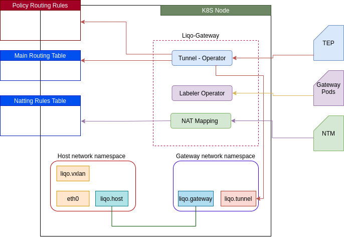

# Liqo-Gateway

The Liqo-Gateway component is made up by several operators and is responsible for establishing secure tunnels to other peering clusters and inserting NAT rules for the remote pod and external CIDRs.

{}
The Liqo-Gateway is a kubernetes deployment whose pods run in host network mode.
{}

The following diagram illustrates the operators which make up the Liqo-Gateway.

While configuring routes, vpn tunnels, and NAT rules Liqo-Gateway avoids conflicts by creating a separate network namespace where all the configurations live. At start up time the following tasks are performed:

* a new network namespace called `liqo-netns` is created;
* a veth pair is created, with one end called `liqo.host` living in the network namespace and the other named `liqo.gateway` living in `liqo-netns` namespace;
* vpn implementations are initialized.

#### Tunnel Operator

The Tunnel Operator reconciles the `tunnelendpoints.net.liqo.io` custom resources (CR). For each tunnelendpoints instance it creates a vpn tunnel to the cluster described by the CR and adds a static route for the remote cluster. If the local subnets used in the local cluster conflict with the remote cluster then natting rules are configured for the cross cluster traffic. The actions described above are carried in the `liqo-netns` network namespace. In the host network namespace a policy routing rule is added by the tunnel operator to instruct the kernel that all the traffic coming from the remote cluster has to be routed based on the contents of the custom routing table with ID `18952`.

{}
The Tunnel Operator expects for the cross cluster traffic generated by local workloads to be routed to the custom network namespace before handling it. Meaning that the Liqo Gateway is agnostic to how the traffic is routed to the `liqo-netns` namespace.
{}

The Tunnel Operator has a pluggable architecture for the vpn technologies used to interconnect clusters. The main idea is to support different vpn implementations for different clusters, based on the information carried by the `tunnelendpoints.net.liqo.io` custom resource. For instance, a cluster A peered with cluster B and C could use a `WireGuard` tunnel to connect with cluster B and an `IPsec` tunnel to connect with cluster C. At the time being only the [WireGuard](https://www.wireguard.com/) implementation is available.

{}
 For best performances WireGuard kernel module needs to be installed on nodes where Liqo Gateway runs. See the [WireGuard installation instructions](https://www.wireguard.com/install/). If the kernel module is not present than a user space implementation called [BoringTun](https://github.com/cloudflare/boringtun) will be used instead.
{}

#### Liqo Gateway Failover - Labeler Operator

Liqo supports active/passive High Availability for the Liqo Gateway component. As stated before, it is a kubernetes deployment and as such its number of replicas can be set to any value. Only one Liqo Gateway instance is elected to leader, hence there is only one active instance at a time in a cluster. The other instances are ready to take over if the leader fails.

{}
Make sure that there are enough nodes to accommodate the replicas, because being the instances in host network no more than one replica can be scheduled on a given node. A given port on the node can be used by only one process.
{}

The Gateway is exposed to the other clusters through a kubernetes service of type `LoadBalancer` or `NodePort` based on the use case scenario. The k8s control plane automatically adds all the replicas of a deployment to the service targeting it. This behaviour does not suit our use case, having only one Liqo Gateway instance active able to serve cross cluster traffic. Here it comes the `Labeler Operator` which makes sure that only the active instance of the Liqo Gateway has the label `net.liqo.io/gateway=active`. Same label is set as selector in the k8s service targeting Liqo Gateway. All the other replicas has the label `net.liqo.io/gateway=standby`.

#### NAT Mapping Operator

Liqo can expose workloads having an IP address that does not belong to the pod CIDR address range by using the external CIDR. The `NAT Mapping Operator` reconciles the `natmappings.net.liqo.io` CR. For each entry in the custom resource it configures a NATTING rule to send the incoming traffic, destined for an external CIDR IP address, to the right workload.

{}
Workloads targeted by an external IP address can live inside a given cluster or be external workloads reachable from the current cluster.
{}
