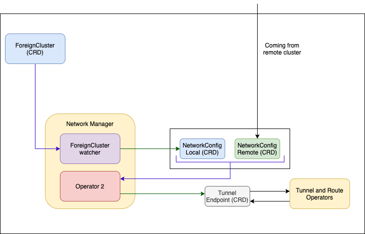
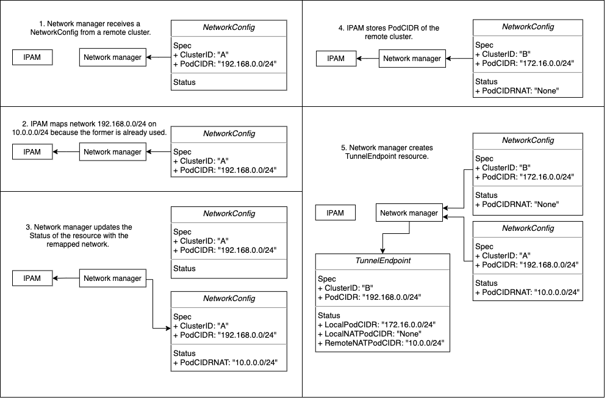

# Network Manager and IPAM

### Network Manager

The Liqo Network Manager is one of the Liqo components in charge of enabling peered clusters to communicate one to another, handling the creation of the `networkconfigs.net.liqo.io` custom resources that will be sent to remote clusters.
Those special resources contain the network configuration of the home cluster: the PodCIDR, for example, is one of the fields of the Spec section of the resource.

{}
The PodCIDR is the IP addressing space used by the CNI to assign addresses to Pods (e.g., _10.0.0.0/16_).
{}

In addition, the Network Manager also processes the NetworkConfigs received from the remote clusters and remaps the remote networks if they overlap with any of the address spaces used in the local cluster (see [IPAM](#ipam) for more information).
When the NetworkConfigs exchanged by the two clusters are ready, the Liqo Network Manager creates a new resource of type `tunnelendpoints.net.liqo.io` which models the network interconnection between the two clusters.

The following diagram illustrates how Liqo Network Manager creates the TunnelEndpoint.
The Network Manager creates a local NetworkConfig for each `foreignclusters.discovery.liqo.io` resource that, as the name suggests, represents a foreign cluster. Then, each NetworkConfig is replicated to the remote cluster it refers to.
The diagram also shows that, at the same time, each remote cluster creates its own NetworkConfig, which is replicated on the original home cluster.
Once the Network Manager has collected both the remote and the local NetworkConfig, an embedded operator is in charge of creating the TunnelEndpoint resource, that resumes the information contained in both resources.
The TunnelEndpoint is then reconciled by the [Tunnel Operator](../gateway#tunnel-operator) and the [Route Operator](../route#route-operator).

A NetworkConfig is created populating only its Spec section with networks used in the local cluster as well as parameters for the VPN tunnel configuration.
Instead, the Status section of a NetworkConfig is updated by the remote cluster which receives it, and for which such a resource has been created (each NetworkConfig specifies in the Spec section its recipient).
The Status section is used to signal to the cluster that has created the resource if its networks have been remapped by the remote cluster.

{}
Traffic between clusters passes through a VPN tunnel configured by exchanging NetworkConfigs.
{}

The following diagram shows how information about the PodCIDR is exchanged by clusters. However, depicted NetworkConfigs do not specify only this address space, but instead contain many other information that have been ignored for the sake of simplicity.
In the provided example, the PodCIDR of the remote cluster is already used (or creates conflicts) in the local cluster, therefore the IPAM module maps it to another network (step 2). The local NetworkManager notifies the remote cluster about the remapping by updating the Status of the resource (step 3). After the remote cluster has processed the local NetworkConfig, the IPAM module stores how the remote cluster has remapped the local PodCIDR (step 4). Finally, the Network Manager creates the TunnelEndpoint resource combining information contained in both NetworkConfigs.

#### Network Parameters Exchange

As we have seen, each cluster creates a NetworkConfig custom resource referring to the remote cluster, containing the required network parameters, and replicates it on the remote cluster. Once received, the remote cluster updates its Status section and replicates the changes back to the original local cluster. This job of replicating a resource and keeping its status in sync between clusters is done by the Liqo CRDReplicator component.

1. The network configuration of Cluster1 is saved in the local NetworkConfig `NCFG(1->2)`, which contains, under the Spec section, the ClusterID of the remote cluster it wants to peer with. The same is done in Cluster2.
2. The `CRDReplicator` running in Cluster1 (which knows how to interact with the API server of Cluster2) replicates `NCFG(1->2)` in the remote cluster. The same is done in Cluster2.
3. Once replicated in Cluster2, the custom resource `NCFG(1->2)` (now living in Cluster 2) is processed and its status is updated with the NAT information (if any). The same is done with `NCFG(2->1)` in Cluster1.
4. The `CRDReplicator` running in Cluster1 reflects the updates made by Cluster2 on `NCFG(1->2)` back in the local copy of `NCFG(1->2)` living in Cluster1. The same is done in Cluster2.
5. The Network Manager in Cluster1 creates the custom resource `TunnelEndpoint` `TEP(1-2)` by using the information present in `NCFG(1->2)` and `NCFG(2->1)`. The same is done in Cluster2.

### IPAM
Embedded within the Liqo Network Manager, the IPAM (IP Address Management) is the Liqo module in charge of:
1. Managing networks currently in use in the home cluster.
2. Translating an offloaded pod's IP address, assigned by the remote cluster, to the corresponding IP address that is visible from the home cluster.
3. Translating Endpoints IP addresses during the [Reflection](../../../offloading/api-reflection#Overview).

#### Networks management
The cluster CNI provider assigns to each Pod a unique IP address, which is valid _within the cluster_ and that allows Pods to talk to each other, directly, even without the use of a Kubernetes _service_.
By applying the same concept, Liqo extends a (first) cluster with the resources shared by a (second) remote cluster, enabling Pods in different (peered) clusters to talk to each other, directly, again without the use of a Kubernetes _service_.
At first, for this to work, it sounds like clusters would have to change their behavior, ensuring Pod IP addresses are routable between clusters, and belong to non-overlapping PodCIDRs in order to avoid conflicts with one another.
However, Liqo does not make any assumption on the address spaces (i.e. PodCIDR and ExternalCIDR) configured in each cluster.
This means that each cluster does not need to change its behavior, as possible issues are automatically solved by Liqo. Inter-cluster Pod-to-Pod communication can thus take place.

{}
The ExternalCIDR is the IP addressing space used by Liqo for assigning addresses to external resources during Reflection (see more [Here](#reflection-of-external-endpoints)).
{}

The IPAM module checks whether the PodCIDR of a remote cluster is already used in the local cluster.
- If it is available, the IPAM reserves that network for the remote cluster. This means IP addresses assigned in the remote cluster are now valid also in the home cluster.
- If a conflict is detected, the IPAM module remaps the (conflicting) PodCIDR of the remote clusters into a new address space, again reserved for that cluster.

The same procedure happens for the ExternalCIDR.

{}
The traffic toward remapped networks will require an additional NAT operation carried out by the [Tunnel Operator](../gateway#tunnel-operator) in the data plane.
{}

In conclusion, the IPAM maintains a list of all the networks currently in use in the home cluster and when a new peering takes place, adds the network reserved to the remote cluster to the list. The network remains in the list as long as the peering is active and it is removed when the peering is terminated. In this way, after the termination of a peering, such a network becomes available for future use.

{}
You can specify reserved networks as parameter of the network-manager and configured by `liqoctl install` or the helm chart. IPAM will add these networks to the list of used networks and will no longer take it in consideration for remote clusters.
{}

#### IP addresses translation of offloaded Pods
Liqo enables the offloading of workloads on (remote) peered clusters, giving at the same time the illusion that offloaded Pods are running on the local cluster.
The [Virtual Kubelet (VK)](../../../offloading#virtual-kubelet) is the component in charge of offloading workloads on the remote cluster, while keeping their status always synchronized between the two clusters.
This allows the administrator of the local cluster to inspect the status of all offloaded pods (hence, running remotely) just like as they were running locally.
However, offloaded Pods are assigned an IP address by the CNI of the foreign cluster, as they actually are run there.
Even if these addresses are valid on the foreign cluster, they may have no meaning in the original cluster.

Assume that clusters A and B have both PodCIDR equal to 10.0.0.0/24 and that their administrators agree to share resources by establishing a Liqo peering.
Thus, the IPAM module of B decides to map A's PodCIDR to an available network, say 192.168.0.0/24.
After the peering has been completed, B offloads Pod A1 on cluster A.
If the CNI of cluster A assigns IP address 10.0.0.34 to Pod A1, the VK(A) running in B detects the IP assignment and needs to update the Shadow Pod Status.

{}
The Shadow Pod is a local copy of the Pod resource that is created and kept up to date by Liqo when offloading a Pod.
{}

In this particular example, while pod A1 has IP 10.0.0.34, its shadow copy (in cluster B) will have IP 192.168.0.34.
Since the IPAM module keeps track of how remote networks have been remapped by the home cluster (see [Networks management](#networks-management)), it can take care of the translation of addresses.
For this reason, IPAM provides an API consumed by the VK when the latter has to update the Shadow Pod Status and therefore its IP address.

{}
The [Tunnel Operator](../gateway#tunnel-operator) will carry out the proper NATs operations in the data plane, translating IP src/dest addresses of the packets coming from/directed to the offloaded Pod.
{}

The IPAM module achieves this task by keeping track of how foreign clusters have remapped local networks and by providing offloaded Pod IP addresses to the Virtual Kubelet when it has to update the Status of Shadow Pods.

#### Reflection
The [Reflection](../../../offloading/api-reflection#Overview) is one of the most relevant Liqo features; it is carried out by the Virtual Kubelet and deals with the replication of local Kubernetes resources on foreign clusters, in particular _Services_ and _Endpoints_.

{}
Once a Pod is offloaded remotely, the Virtual Kubelet takes care of creating a Shadow Pod locally and keeping it updated by inspecting its remote counterpart. During the reflection of an Endpoint instead, the Virtual Kubelet only creates the Endpoint on the foreign cluster.
{}

In general, Endpoints that are going to be reflected can live either on:
1. The local cluster, this is the case of Pods running on the home cluster and possibly offloaded.
2. Elsewhere, such as Pods running neither on the home cluster nor on the cluster the reflection is going to happen, but in a third one.

In both cases, the IPAM module plays a decisive role, as it is in charge of translating IP addresses of reflected Endpoints. Those IPs will be provided to the Virtual Kubelet, that in turn will reflect adjusted Endpoints.

##### Reflection of local Endpoints
As mentioned in the [Translation of offloaded Pods](#ip-addresses-translation-of-offloaded-pods) Section, even if two clusters have established a Liqo peering, IP addresses that are valid in one of them could have no meaning in the other, therefore an address translation needs to be carried out somewhere. Endpoint IP addresses are not an exception: if an Endpoint resource represents a Pod running locally, just replicating the resource on a foreign cluster is not enough to make it available to remote Pods because the IP address specified in the resource could have no validity in the foreign cluster.

If the remote cluster has not remapped the local PodCIDR, the IPAM module performs no translations, returning to the Virtual Kubelet the original Endpoint address. Conversely, if the address space used for assigning addresses to local Pods creates conflicts in the remote cluster and therefore has been remapped, the IPAM uses (1) the original Endpoint IP and (2) the new address space used to remap the local PodCIDR to carry out the translation of the address.

##### Reflection of external Endpoints
The address translation of local Endpoints can be carried out thanks to the fact that the local IPAM knows if and how the local PodCIDR has been remapped in the cluster the reflection is going to take place. The problem of reflecting on cluster _X_ an Endpoint running on cluster _Y_ is way harder, if the home cluster is neither _X_ nor _Y_. The root problems are the following:
1. Cluster _X_ and cluster _Y_ may not have a Liqo peering, thus their Pods could not be able to talk to each other.
2. Even if such a peering existed, the home cluster would not have any information about the network interconnection between _X_ and _Y_. In other words, the local cluster would not be aware of how _X_ could have remapped the PodCIDR of _Y_.

The current solution to these issues is based on the usage of an additional network, called _ExternalCIDR_. Its name comes from the fact that addresses belonging to this network are assigned to external (i.e., non-local) Endpoints that are going to be reflected on a foreign cluster. Each Liqo cluster has its own ExternalCIDR address space which can be remapped by peered clusters, just like the PodCIDR.

Whenever the IPAM receives an Endpoint address translation request by the Virtual Kubelet and the address does not belong to the local PodCIDR, the IPAM module allocates an IP from the ExternalCIDR address space and returns it to the Virtual Kubelet. The ExternalCIDR address could be further translated if the remote cluster has remapped the local ExternalCIDR. That's not all: the IPAM stores the associations between Endpoint addresses and ExternalCIDR addresses so that future address translation requests on the same Endpoint address will use the same ExternalCIDR address. This is useful in case that Endpoint is reflected on yet another cluster, using that same ExternalCIDR address.

Suppose cluster B has a Liqo peering with clusters A and C. Therefore, cluster B can offload Pods on them. However, clusters A and C do not have an active peering and, thus, their Pods cannot connect. Furthermore, assume that B wants to reflect Service A in cluster A. The Service exposes the Shadow Pod C1, whose remote counterpart lives in C with IP address 10.1.0.5. In this particular case, if the IPAM did not translate the Endpoint's address, Pods in A would not be able to reach Service A. Pods in cluster A do not know how to connect to network 10.1.0.0/24 (and therefore to Pods in C). They can only reach Pods in B, as depicted in the IPAM block of cluster A.

In this example, the Virtual Kubelet (related to A and running on B) asks the IPAM module for an Endpoint address translation. The IPAM notices the received address does not belong to the local PodCIDR 10.0.0.0/24 and therefore allocates a new address from the ExternalCIDR network, in this case 192.168.0.45. The IPAM stores the association between addresses and returns 192.168.0.45 to the Virtual Kubelet, that in turn completes the reflection.

It is worth pointing out that traffic toward the ExternalCIDR passes through the cluster that has reflected the external resource before reaching its final destination (it is a _Hub and Spoke_ topology such as A <--> B <--> C, where B offloaded Pods in both A and C, and a Pod in A has to contact a Pod in C).
This means that the cluster that reflects a Pod using its ExternalCIDR receives the data-plane traffic directed to that Pod, which has to be further redirected to the third cluster to reach the actual Pod.
This is achieved thanks to the `natmappings.net.liqo.io` resource, which is populated by the IPAM (in Cluster B) with the associations between the Pod IP addresses (the actual Pod in C) and the associated ExternalCIDR addresses.
This resource is reconciled by the [Tunnel Operator](../gateway#tunnel-operator) that adds the proper NAT rules.
