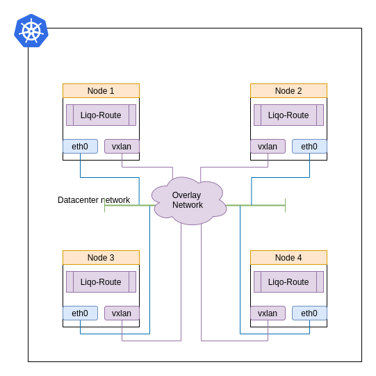
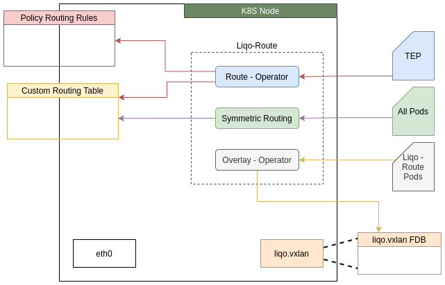
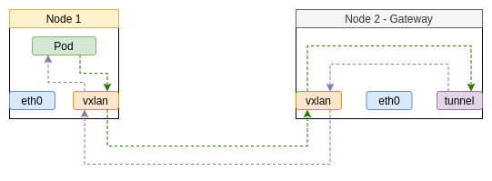

# Liqo-Route

The Liqo-Route component is made up by several operators and runs on each node of the cluster. It is responsible for:

* creating a VXLAN interface on the host and adding it to the overlay network;
* configuring routes and policy routing rules to send  cross cluster traffic to the right VTEP of the active Liqo Gateway, when not running on the same node as the Liqo Gateway;
* configuring routes and policy routing rules to send traffic to the [`liqo-netns`](../gateway#tunnel-operator) network namespace when running on the same node as the Liqo Gateway.

The following diagram shows how nodes in a cluster are interconnected by the overlay network.

{}
The Liqo-Route is a kubernetes [`DaemonSet`](https://kubernetes.io/docs/concepts/workloads/controllers/daemonset/) whose pods run in host network mode.
{}

The following diagram illustrates the operators which make up Liqo-Route.

The Liqo-Route component is kept simple as much as possible by design. The reason is to have a solution that is agnostic to supported CNI plugins and cloud providers. It does not interfere with the existing configuration or existing network interfaces. It does that by creating a VXLAN network interface and using a custom routing table for routes needed by the cross cluster traffic.

{}
One thing that the component does not is to mess with the `iptables` configuration to prevent the SNATing of the traffic leaving the cluster. Usually the cross cluster traffic is SNATed by the CNI plugins, and if this behaviour is not desired they provide ways to disable the masquerading.
{}

#### Overlay Operator

When the Liqo Route component starts it creates a VXLAN network interface named `liqo.vxlan`. The reference configuration for VXLAN is to use an IP multicast group to join the other VTEPs. Since we cannot assume that multicast is supported everywhere, the VXLAN overlay is deployed in `unicast` mode with static L2 entries. The Overlay Operator is the glue that updates the `FDB` entries for the `liqo.vxlan` device. The logic is straightforward, the operator watches for the Liqo Route pods in the namespace where Liqo is deployed and does the following:

* pod running on the current node: it annotates it with the MAC address of the `liqo.vxlan` device;
* pod running on different node: it populates the `FDB` of the `liqo.vxlan` device with the information of the remote VTEP.

#### Route Operator

The Route Operator reconciles the `tunnelendpoints.net.liqo.io` custom resources (CR). For each `tunnelendpoints.net.liqo.io` instance it configures the routes and the policy routing rules based on the node where it is running:

* same node as Liqo Gateway: routes and policy routing rules are configured to send all the traffic through the `liqo.host` network interface;
* other nodes: routes and policy routing rules are configured to send the traffic to the remote VTEP on the node where the Liqo Gateway is running.

All the routes are inserted in the custom routing table with ID `18952`. In case the active Liqo Gateway fails all the routes are dynamically reconfigured to send the traffic to the right node where the new active instance is running.

#### Symmetric Routing Operator

We have seen how the locally generated traffic is routed toward the Liqo Gateway, now we will face the problem of the incoming traffic from a remote cluster. When incoming traffic for local workloads leaves the Liqo Gateway it has as destination IP address the IP of a local pod. That traffic could be handled by the local CNI plugin as showed on the following diagram.

Clearly it is a case of asymmetric routing that in most of the cases will not work. The linux kernel by default for each packet coming in an interface will check weather the source of the packet is reachable through the interface it came in. If it is routable through the interface which it came in then the packet will be accepted otherwise it will be dropped. A solution could be to set the `reverse path filtering` in loose mode on the `eth0` interface in order to accept the incoming cross cluster traffic. But in some cases, such as AWS EKS, the underlying network fabric does the source/destination validation and drops the traffic.

The Symmetric Routing operator is in charge to configure the routes in order to reach the local pods through the overlay network. It watches all the pods running on the cluster except for the ones running on its own node. For each one of them configures the correct route, in routing table `18952`, toward the right VTEP. Those routes are used only on the node where the active instance of Liqo Gateway is running. The policy routing rule used for the incoming traffic is configured by the [Tunnel Operator](../gateway#tunnel-operator). The following diagram shows how the outgoing and incoming cross cluster traffic flows.

