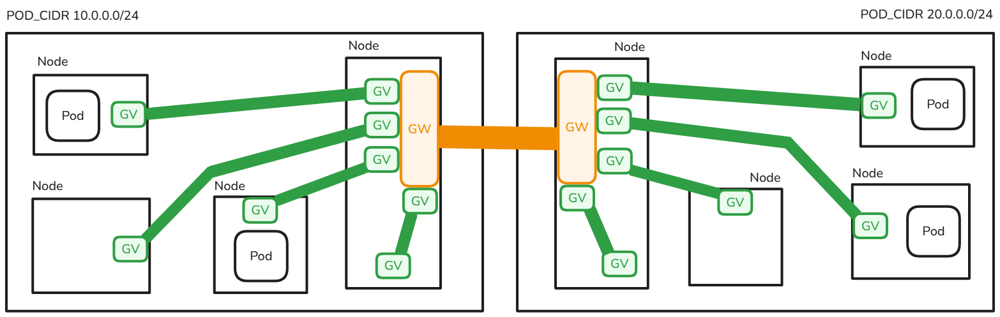
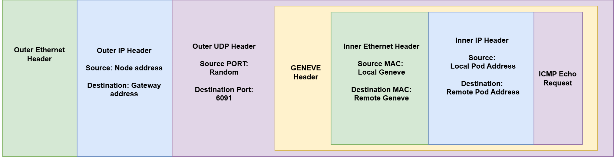
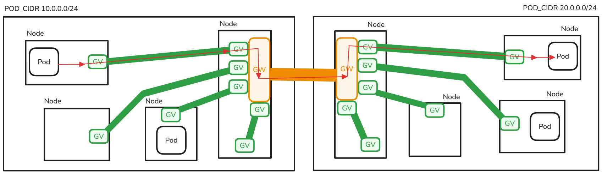

# Basic Concepts

Liqo network is a cloud-native solution that enables seamless communication between Kubernetes clusters. In particular, it allows pod-to-pod communication across clusters. This means that the **services** and **endpointslices** reflection is not managed by the networking module (it is managed by the virtual-kubelet).

The two main areas of the Liqo network are:

- **Internal network**: it manages the traffic inside the cluster and forwards it between nodes and gateways. It uses the Geneve protocol to encapsulate the traffic (the green tunnels in the image below).
- **External network**: it manages the traffic between different clusters. It uses WireGuard to create a secure tunnel between gateways (the orange tunnels in the image below).

## Internal network

In the internal network, every node is connected to a different gateway using a dedicated Geneve tunnel. This architecture ensures that:

- For each node, there is a dedicated Geneve interface on every gateway.
- For each gateway, there is a dedicated Geneve interface on every node.

Each Geneve interface is assigned an IP address from the **internal CIDR**. This allows the interfaces to be reachable and enables you to ping the Geneve interfaces both from the node and from the gateway, facilitating connectivity checks and troubleshooting.

### Details on GENEVE

  

Geneve is used to traverse the CNI and reach the Gateway efficiently, without altering the original traffic generated by the pod.
The GENEVE interface encapsulates Ethernet traffic into a UDP datagram without encryption (Ethernet over IP). The external IP packet has the node's address as its source address and the gateway as its destination address. The destination port is, by default for Liqo, 6091.
Once encapsulated, the packet can be processed by the CNI without issues, as its destination is clearly defined.
The encapsulated traffic is reintroduced into the CNI and routed to the Gateway. If the Gateway resides on a different node, the traffic may undergo additional encapsulation, resulting in nested encapsulation. This behavior depends on the CNI's handling of inter-node communication and is beyond the scope of Liqo.

## External network

In the external network, traffic between different clusters is managed.

Each WireGuard tunnel is created inside a dedicated gateway pod. For every peering, a dedicated gateway pod is deployed in both clusters involved in the connection. Each gateway pod establishes a secure WireGuard tunnel that connects only to a single remote cluster. This means that every gateway can point to just one remote cluster, ensuring isolation and security for each inter-cluster connection.

There are two types of gateway pods: **gateway-client** and **gateway-server**.

- The **gateway-client** acts as a WireGuard client, initiating the connection to the remote cluster.
- The **gateway-server** acts as a WireGuard server, accepting incoming connections from remote clients. The gateway-server must expose itself using a Kubernetes Service, which can be of type LoadBalancer, NodePort, or ClusterIP, depending on the cluster's networking setup and requirements.

### Gateway Details
 Each gateway in Liqo is equipped with at least three distinct interfaces:

- The default interface, which serves as the direct link to external networks.
- A GENEVE interface for each node within the cluster (at least one in the case of a single-node cluster).
- A tunnel interface for communication with the remote Gateway, WireGuard by default.

The Gateway is also responsible for performing DNAT and SNAT to support the remapping of the remote cluster.

#### Further details about GENEVE

GENEVE-encapsulated traffic arrives at the gateway via the default interface. A GENEVE socket listens on port 6091. Here, the traffic is processed, decapsulated, and reintroduced into the gateway through the GENEVE interface itself. Once the packets are ready for transmission to the remote cluster, they are directed through the WireGuard interface using policy routing.

_Note_: Within the Gateway, a route is also configured to direct all traffic arriving from the tunnel and destined for a local pod back to the appropriate GENEVE interface.

#### Details on Wireguard

WireGuard is a secure protocol that encapsulates IP packets within UDP, ensuring encryption of the inner content. Unlike GENEVE, WireGuard operates at Layer 3 (L3), meaning its interface does not possess a MAC address.
In Liqo, during configuration, the local WireGuard interface is set to contact the appropriate endpoint, which in this case is the address of the node hosting the remote Gateway.
Once encapsulated, the traffic is reintroduced into the Gateway and exits via the default interface. It then traverses the node and exits through its primary interface to reach the remote endpoint.

### Recap of Packets flow

The flow of a packet from a pod in one cluster to a pod in another cluster involves several steps:

1. The packet originates from a pod and reaches its node through a virtual Ethernet interface. This is managed by the CNI and is standard Kubernetes networking behavior (Liqo is not responsible for this part).
2. From the node, the packet enters a Geneve tunnel using a specific [route](routeconfiguration.md#local-cluster-id-node-gw-node).The packet arrives at the other end of the Geneve tunnel, inside the gateway pod.
3. The gateway does DNAT and routes the packet into the WireGuard tunnel([check [this route](routeconfiguration.md#local-cluster-id-gw-ext-gateway)]).
4. The traffic reaches the gateway pod in the remote cluster. It is decrypted by the WireGuard driver and reinserted into the stack. It is then routed to the correct Geneve interface to reach the node hosting the target pod.This is achieved using the following [routes](routeconfiguration.md#local-cluster-id-node-name-gw-node-gateway). After routing, SNAT is applied.
5. The packet is then forwarded from the node to the target pod, leveraging the CNI.

The return traffic follows the same path in reverse, ensuring symmetric routing between the two pods across clusters.

## CIDR Remapping

Liqo enables two clusters to peer even if they have the same pod CIDR. Each cluster can independently remap the remote cluster’s pod CIDR to a different, locally chosen CIDR. This remapped CIDR is decided by each cluster on its own and is not shared with other clusters.

For example, if both Cluster A and Cluster B use 10.0.0.0/16 as their pod CIDR, Cluster A can remap Cluster B’s pod CIDR (10.0.0.0/16) to a new CIDR, such as 11.0.0.0/16. As a result, Cluster A will be able to reach a pod in Cluster B with IP 10.0.0.6 using the remapped IP 11.0.0.6. The same applies in the opposite direction if Cluster B chooses to remap Cluster A’s CIDR.

When a packet directed to a remote pod enters the gateway, its destination IP is the remapped one. The gateway performs a DNAT operation to replace this remapped address (used only within the local cluster) with the corresponding real IP address used by the remote cluster.

In the example above a packet originating from a local pod destined for a remote pod enters the Gateway with the IP address `11.0.0.6` and will be translated to `10.0.0.6` by the Gateway before being sent to the remote cluster.

In a similar way, when the gateway receives incoming traffic, its source IP is the real one used by the remote cluster, so it is SNATed to the remapped one before being sent to the appropriate pod.

All the remapping logic is managed by the IPAM component of liqo, which tracks the used IPs and CIDRs inside the cluster.

All the firewall rules for managing this remapping is handled inside the gateway pods, ensuring seamless communication even in the presence of overlapping CIDRs.

The same logic is applied also to the **external CIDR**. This means that every cluster will be able to remap its neighboring cluster's external CIDR to a different, locally chosen CIDR. Pay attention that if you don't change the default external CIDR used by Liqo (check the helm values), every cluster will use the same external CIDR and neighbour's external CIDRs will appear always remapped.

## Example
A full example of the entire path can be found [here](./basic_example.md)