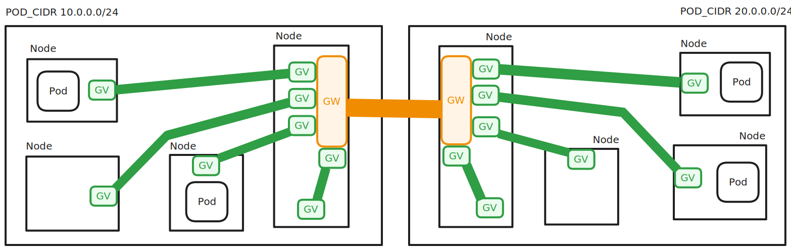
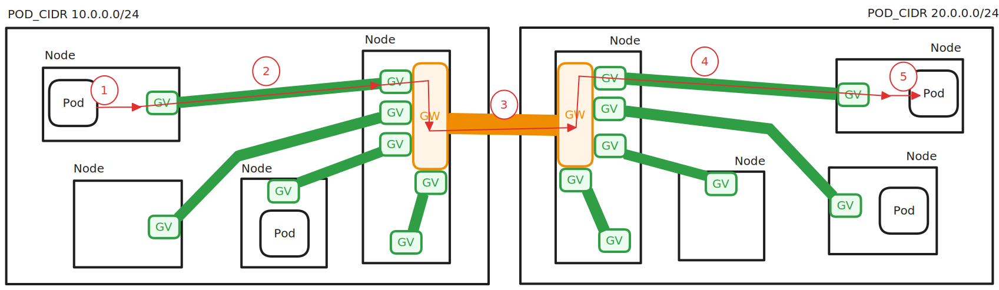
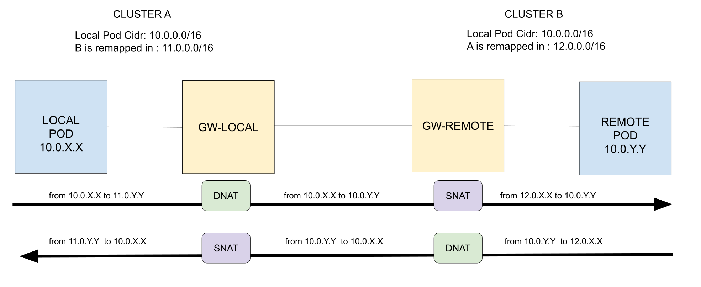

# Basic Concepts

The **Liqo network** is a cloud-native solution that enables seamless communication between Kubernetes clusters.
In particular, it allows pod-to-pod communication across clusters, i.e., enabling the IP traffic exiting from a pod on a first cluster to be delivered to another pod running on a second cluster.
This means that the **services** and **endpointslices** reflection is not managed by the networking module (it is managed by the virtual-kubelet).

The Liqo network is split in to main parts:

- **Internal network**: it manages the traffic inside the cluster and forwards it between nodes and gateways. It uses the Geneve protocol to encapsulate the traffic (the green tunnels in the image below).
- **External network**: it manages the traffic between different clusters. It uses WireGuard to create a secure tunnel between gateways (the orange tunnels in the image below).

## Internal network

In the internal network, each node is connected to the pod acting as **cluster gateway** (one for each peering) using a dedicated Geneve tunnel.
According to this architecture, each node has one Geneve interface that takes all the traffic generated by local pods and directed to a remote pod, and sends it to the gateway pod.
On the other side, the cluster gateway has a number of Geneve interfaces (hence, tunnels) equal to the number of nodes in the Kubernetes cluster.
As a consequence, the number of Geneve tunnels in Liqo is equal to the number of _nodes_, and it does not depend on the number of _pods_.

Each Geneve interface is assigned an IP address from the **internal CIDR**.
This allows the interfaces to be reachable and enables you to ping the Geneve interfaces both from the node and from the gateway, facilitating connectivity checks and troubleshooting.

### Details on GENEVE

[Geneve](https://github.com/torvalds/linux/blob/master/drivers/net/geneve.c) is used to traverse the CNI and reach the Gateway efficiently, without altering the original traffic generated by the pod.
The GENEVE interface encapsulates Ethernet traffic into a UDP datagram without encryption (Ethernet over IP).

The external IP packet has the node's address as its source address and the gateway as its destination address. The destination port is, by default for Liqo, 6091.
Once encapsulated, the packet can be processed by the CNI without issues, as its destination is clearly defined.
The encapsulated traffic is taken by the CNI and routed to the Gateway, as formally this traffic looks like a packet generated by the note itself.
If the Gateway resides on a different node, the traffic may undergo additional encapsulation depending on the CNI technology in use, possibly resulting in nested encapsulation.
This behavior depends on the CNI's handling of inter-node communication and is beyond the scope of Liqo.

#### Known Limitations: Geneve and Kubernetes Services

Technologies that leverage UDP tunnels, such as Geneve, do not support the traversal of intermediate NATs.
The reason can be found on the [RFC 7348](https://www.rfc-editor.org/rfc/rfc7348.html):

> It is recommended that the UDP source port number
> be calculated using a hash of fields from the inner packet --
> one example being a hash of the inner Ethernet frame's headers.
> This is to enable a level of entropy for the ECMP/load-
> balancing of the VM-to-VM traffic across the VXLAN overlay.

In other words, Linux performs _source port hashing_ when encapsulating the pod traffic in the Geneve tunnel, meaning the source port in the UDP header is ephemeral and is calculated per-packet based on 5-tuple of the internal packet.
Therefore, traffic tunneled in UDP cannot traverse the NAT because the UDP 5-tuple in the incoming/outgoing directions are not equal (due to the UDP source port hashing), hence the tuple cannot be found in the connection tracking table of the NAT.

Since Kubernetes Services are implemented with DNAT rules and Connection Tracking (hence, are not associated to any network interface), Geneve tunnels cannot support any kind of Kubernetes Service as endpoint (ClusterIP, NodePort, or LoadBalancer), but must be directed to the _real_ IP of the pod/node, which is guaranteed to handled by the CNI without any NAT mechanism.
This is the reason why **Liqo creates Geneve tunnels that are established directly on Pod or Node IPs**.
As a consequence, the Liqo internal network relies on dedicated controllers that dynamically track the actual Gateway IP, with specific implementations for the [client](https://github.com/liqotech/liqo/blob/8543b7ff7c34e601b60cde3f1666f3146ed29b71/pkg/liqo-controller-manager/networking/internal-network/client-controller/client_controller.go#L130) and [server](https://github.com/liqotech/liqo/blob/8543b7ff7c34e601b60cde3f1666f3146ed29b71/pkg/liqo-controller-manager/networking/internal-network/server-controller/server_controller.go#L130) roles.

## External network

The external network handles the traffic between two different clusters peered with Liqo.

Although Liqo provides extensibility mechanisms that facilitate the adoption of different inter-cluster technologies, at the current stage only Wireguard is implemented.

Each cluster has a dedicated gateway pod per each peering; a point-to-point Wireguard tunnel with the remote cluster is terminated inside this gateway pod.
Hence, each gateway pod handles only a single, secure WireGuard tunnel, which is connected to the remote cluster, ensuring isolation and security for each inter-cluster connection.

There are two types of gateway pods: **gateway-client** and **gateway-server**.

- The **gateway-client** acts as a WireGuard client, initiating the connection to the remote cluster.
- The **gateway-server** acts as a WireGuard server, accepting incoming connections from remote clients. The gateway-server must expose itself using a Kubernetes Service, which can be of type LoadBalancer, NodePort, or ClusterIP, depending on the cluster's networking setup and requirements.

### Gateway Details

Each gateway in Liqo handles at least three distinct interfaces:

- The default interface, which serves as the direct link to external networks.
- A GENEVE interface to each node within the cluster (at least one in the case of a single-node cluster).
- A tunnel interface to the remote Gateway, using WireGuard by default.

The gateway pod is also responsible for performing DNAT and SNAT to support the remapping of the pod addresses used in the remote cluster, which is enabled automatically by Liqo in case both clusters use the same Pod CIDR.
More details on the [CIDR Remapping](#cidr-remapping) section below.

#### Routing traffic inside the gateway

The traffic generated by user pods, and directed to the remote cluster, arrives at the gateway pod via the default interface, encapsulated in a GENEVE tunnel.
This traffic is transported by the underlying CNI, as it appears a normal traffic from the IP address of a Node, and the IP address of the gateway pod; hence, the CNI does not have any glue that this traffic is actually a GENEVE tunnel.
This traffic arrives at the gateway via the default interface, directed to a GENEVE socket listening on port 6091.
Here, the traffic is processed, decapsulated, and reintroduced into the gateway through the GENEVE interface itself.
Once the packets are ready for transmission to the remote cluster, they are redirected to the WireGuard interface using policy routing.

_Note_: Within the Gateway, a route is also configured to direct all traffic arriving from the tunnel and destined for a local pod back to the appropriate GENEVE interface.

#### Details on Wireguard

[WireGuard](https://www.wireguard.com/) is a secure protocol that encapsulates IP packets within UDP, ensuring encryption of the inner content.
Unlike GENEVE, WireGuard operates at Layer 3 (L3), meaning its interface does not have a MAC address.
In Liqo, during configuration, the local WireGuard interface is set to contact the appropriate endpoint, which in this case is the address of the node hosting the remote Gateway.
Once encapsulated, the traffic is re-injected into the Gateway and exits via the default interface of the pod.
It then traverses the node and exits through its primary interface to reach the remote endpoint.
Hence, also this traffic, tunneled with Wireguard, is handled as normal traffic by the underlying CNI, and it appears as generated by a local pod and directed to an IP address outside the cluster.

### Recap of Packets flow

The flow of a packet from a pod in one cluster to a pod in another cluster involves several steps:

1. The packet originates from a pod and reaches the TCP/IP stack of the node through a virtual Ethernet interface. This step is managed by the CNI and follows the standard behavior of Kubernetes networking (Liqo is not involved in this step).
2. From the node, the packet enters into a Geneve tunnel using a specific [route](routeconfiguration.md#remote-cluster-id-node-gw-node), added by Liqo. The Liqo route captures all the traffic that goes towards the Pod CIDR of the remote Liqo cluster. The packet arrives at the other end of the Geneve tunnel, inside the gateway pod. 
3. In case the local and remote clusters have overlapped Pod CIDRs, the gateway applies proper DNAT rules; then, it routes the packet into the WireGuard tunnel ([check [this route](routeconfiguration.md#remote-cluster-id-gw-ext-gateway)]), where is properly encrypted, then passed to the node TCP/IP stack for further processing.
4. From the node, the packet follows the normal TCP/IP stack processing and exits from the local cluster. This step is managed by the CNI and follows the standard behavior of Kubernetes networking (Liqo is not involved in this step).
5. The tunneled Wireguard traffic reaches the gateway pod in the remote cluster. It is decrypted by the WireGuard driver and re-injected into the stack, within the pod itself. Then, it is routed to the Geneve interface of the tunnel that terminates on the node hosting the target pod. This is achieved using the following [routes](routeconfiguration.md#local-cluster-id-node-name-gw-node-gateway). After routing, and in case the local and remote clusters have overlapped Pod CIDRs, SNAT is applied.
6. Once reached the target node, the packet exits from the Geneve tunnel and is then forwarded to the target pod. This step is managed by the CNI and follows the standard behavior of Kubernetes networking (Liqo is not involved in this step).

The return traffic follows the same path in opposite order, ensuring symmetric routing between the two pods across clusters.

### TCP Clamping

When the IP traffic traverses a tunnel, there is always the risk that large IP packets need to be fragmented before encapsulating them into the tunnel.
Unfortunately, not all the packets can be fragmented (e.g., the ones that have the IP _Don't Fragment_ flag turned on), and in this case the packet is dropped.
	
Although Liqo does it best to limit this problem, e.g., by reducing the MTU at the traffic source, this is not always effective.
Therefore, starting from version 1.1, Liqo implements the TCP Clamping mechanism on all the traffic traversing the Wireguard tunnel.
This behavior is controlled by a new flag that is active by default, although it can be changed in the [Helm values file](https://github.com/liqotech/liqo/blob/6b287acbfe0c2bb2ea065aa6f4ae7928b00a4d95/deployments/liqo/values.yaml#L60).
	
In a nutshell, when the TCP handshake mechanism establishes a new TCP session, the two TCP endpoints agree on the maximum chunk of data that can be exchanged on that connection, the so called Maximum Segment Size (MSS).
The TCP clamping mechanism acts as a _bump in the wire_ and it intercepts this negotiation, adapting the MSS value to the MTU of the Wireguard tunnel, so that the TCP endpoints will never generate a chunk of data that requires the IP packet to be fragmented.

For more information, check the _TCP Clamping_ section on this [documentation](https://www.cloudflare.com/learning/network-layer/what-is-mss/) provided by Cloudflare.

## CIDR Remapping

Liqo enables two clusters to peer even if they have the same pod CIDR.
Each cluster can independently remap the remote cluster’s pod CIDR to a different, locally chosen CIDR.
This remapped CIDR is decided locally by each cluster and is not shared, nor need to be negotiated, with other clusters.

For example, if both Cluster A and Cluster B use `10.0.0.0/16` as their pod CIDR, Cluster A can remap Cluster B’s pod CIDR (`10.0.0.0/16`) to a new CIDR, such as `11.0.0.0/16`.
As a result, Cluster A will be able to reach a pod in Cluster B with IP `10.0.0.6` using the remapped IP `11.0.0.6`.
The same applies in the opposite direction if Cluster B chooses to remap Cluster A’s CIDR.

When a packet directed to a remote pod enters the gateway, its destination IP address is the remapped one.
The gateway performs a DNAT operation to replace this remapped address (used only within the local cluster) with the corresponding real IP address used by the remote cluster.
Hence, when the packet enters in the Wireguard tunnel, the destination IP address is the actual one of the remote destination pod.

In the above example, a packet originating from a local pod and directed to a remote pod enters the Gateway with the IP address `11.0.0.6`, which will be translated to `10.0.0.6` by the Gateway before sending it to the remote cluster.

However, the DNAT on the outgoing traffic is not enough to guarantee a successful communication to the remote pod.
In fact, when the gateway on the other side of the Wireguard tunnel receives the above packet as an incoming traffic, it applies a SNAT rule to the packet, hence remapping the source address (which still belongs to the Pod CIDR of the first cluster) into the proper remapped Pod CIDR of the first cluster.
Then, the packet continues its journey to the final pod.

Liqo clearly splits the responsibilities of the DNAT and SNAT steps (which are both required when two networks with overlapped IP addresses needs to be connected seamlessly without IP renumbering) into the two involved gateway pods: the _exiting_ gateway performs DNAT, the _entering_ gateway performs SNAT.
This splitting of responsibilities allow both gateways to run independently, without having to coordinate themselves about the addresses used in the IP remapping process, hence simplifying the overall management of this process.
In fact, all the remapping logic is managed locally by the Liqo IPAM component, which tracks the used IPs and CIDRs inside the cluster, and therefore can simply decide which IP address ranges could be used in the remapping process.

All the firewall rules for managing this remapping is handled inside the gateway pods, ensuring seamless communication even in the presence of overlapping CIDRs.

The same logic is applied also to the **External CIDR**.
This means that each cluster will be able to remap its neighboring cluster's External CIDR to a different, locally chosen CIDR.
Pay attention that if you do not change the default External CIDR used by Liqo (check the Helm values), each cluster will use the same External CIDR, hence neighbour's external CIDRs will appear always remapped.

## Example

A complete example of the entire journey of a packet can be found [here](./basic_example.md)
