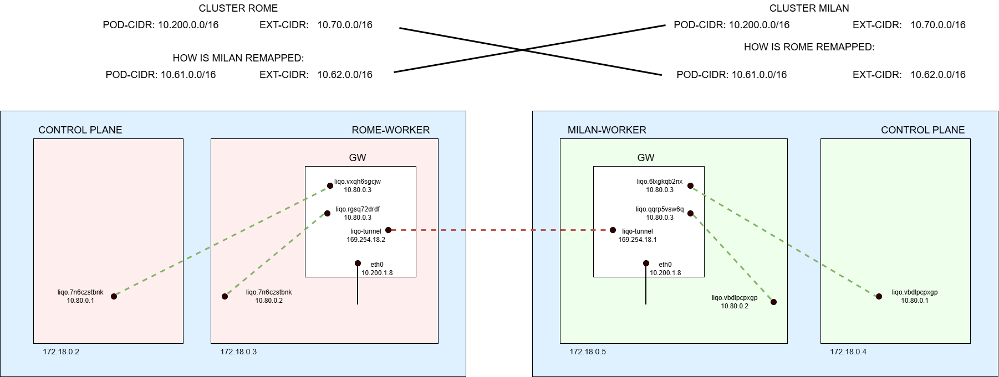

# Firewall Configuration

The **firewall configuration** is a CRD (Custom Resource Definition) that defines a set of **nftables** rules.

**Firewall configurations** are managed by a dedicated controller running inside gateways and fabric pods. This controller reconcile the **firewall configurations** and applies the rules.

The configurations presented in the following sections were collected from the setup in the picture, specifically from the **Rome cluster**.



## Before Peering

### \<node-name\>-gw-masquerade-bypass (Node)

Some CNIs masquerade traffic from a pod to a node (not running the pod) using the node's internal IP. In the figure above, if a pod has IP `10.200.1.8` (e.g., the gateway pod) and is scheduled on a node with internal IP `172.18.0.3`, pinging another node will result in packets having `172.18.0.3` as the source IP.

This behavior has been observed in the following scenarios:

- Azure CNI
- Calico (when pod masquerade is enabled, e.g., Crownlabs)
- KindNet

This can be problematic because Geneve does not support NAT (or IP changes) between the two hosts. When a Geneve tunnel needs to be established (such as between gateway pods and nodes), both hosts must be able to "ping" each other using the IP assigned to their network interface.
In the case described above, the source address of packets sent by the gateway pod to another node via the Geneve tunnel is masqueraded with the IP address of the node where the gateway pod is running.

This firewall configuration solves the issue using the same approach as the **\<tenant\>-masquerade-bypass** configuration. The double SNAT trick is also used here to prevent masquerading. That's because a SNAT rule that enforces a specific IP address nullify any subsequent SNAT rules targetting that address. The same applies to DNAT rules.
For instance , if a packet uses 10.0.0.1 as the source IP, a SNAT that enforces 10.0.0.1 will nullify any subsequent SNAT rules targetting 10.0.0.1.
Which means that if a SNAT is applied on traffic coming from the IP address of the gateway and enforces its same IP address, prevents the CNI from source natting packets from the gateway with the IP address of the node.
Whenever a gateway pod is scheduled on a node, a rule is added only on that specific node (whose name is reported in the label `networking.liqo.io/firewall-unique`). It matches only traffic with the gateway IP as the source and the Geneve port as the destination.
In the example below, the rule is instantiated only on the `rome-worker` node, which hosts the gateway pod, and it targets traffic destined to all Geneve interfaces.

```yaml
apiVersion: networking.liqo.io/v1beta1
kind: FirewallConfiguration
metadata:
  labels:
    liqo.io/managed: "true"
    networking.liqo.io/firewall-category: fabric
    networking.liqo.io/firewall-subcategory: single-node
    networking.liqo.io/firewall-unique: rome-worker
    networking.liqo.io/gateway-masquerade-bypass: "true"
  name: rome-worker-gw-masquerade-bypass
  namespace: liqo
spec:
  table:
    chains:
      - hook: postrouting
        name: pre-postrouting
        policy: accept
        priority: 99
        rules:
          natRules:
            - match:
                - ip:
                    position: src
                    value: 10.200.1.8
                  op: eq
                  port:
                    position: dst
                    value: "6091"
                  proto:
                    value: udp
              name: gw-milan-6b7845f746-s9crd
              natType: snat
              targetRef:
                kind: Pod
                name: gw-milan-6b7845f746-s9crd
                namespace: liqo-tenant-milan
              to: 10.200.1.8
        type: nat
```

### service-nodeport-routing

This rule set uses connection tracking marks (`ctmark`) to associate each connection with the node it originates from, and to restore the corresponding mark in the packet metadata when return traffic traverses the gateway.

Traffic coming from the `rome-control-plane` node is marked with `1`, while traffic coming from the `rome-worker` node is marked with `2`.

The rule in the `prerouting` hook copies the stored `ctmark` into the packet metadata for return traffic arriving through the `liqo-tunnel` interface. In this way, the gateway can correctly route the traffic back to the corresponding Geneve interface.

```yaml
chains:
  - hook: forward
    name: mark-to-conntrack
    policy: accept
    priority: 0
    rules:
      filterRules:
        - action: ctmark
          match:
            - ip:
                position: src
                value: 10.70.0.0
              op: eq
            - dev:
                position: in
                value: liqo.vxqh6sgcjw
              op: eq
          name: rome-control-plane
          value: "1"
        - action: ctmark
          match:
            - ip:
                position: src
                value: 10.70.0.0
              op: eq
            - dev:
                position: in
                value: liqo.rgsq72drdf
              op: eq
          name: rome-worker
          value: "2"
    type: filter
  - hook: prerouting
    name: conntrack-mark-to-meta-mark
    policy: accept
    priority: 0
    rules:
      filterRules:
        - action: metamarkfromctmark
          match:
            - ip:
                position: dst
                value: 10.70.0.0
              op: eq
            - dev:
                position: in
                value: liqo-tunnel
              op: eq
          name: conntrack-mark-to-meta-mark
    type: filter
```

## After Peering

### \<tenant-name\>-masquerade-bypass (Node)

This firewall configuration contains several rules with different purposes.

Sometimes CNIs masquerade traffic which is not part of the pod CIDR. This masquerade can cause issues when the traffic needs to be routed back to the originating cluster. To prevent this, a SNAT rule is applied to packets that are originated from the local pod CIDR (`10.200.0.0/16`) and destined to the (remapped) remote pod CIDR (`10.61.0.0/16`).

```yaml
 - match:
          - ip:
              position: dst
              value: 10.61.0.0/16
            op: eq
          - ip:
              position: src
              value: 10.200.0.0/16
            op: eq
          name: podcidr-milan
          natType: snat
          to: 10.200.0.0/16
```

The following rules enforce the presence of the first external CIDR IP in packets received by NodePort services. Refer to the **service-nodeport-routing** firewall configuration for more details.

```yaml
- match:
          - ip:
              position: dst
              value: 10.61.0.0/16
            op: eq
          - ip:
              position: src
              value: 10.200.0.0/16
            op: neq
          name: service-nodeport-milan
          natType: snat
          to: 10.70.0.0
```

The other rules apply the same concept but for the external CIDR.

**This rule is the reason why NodePorts do not work with Cilium without kube-proxy. With no-kubeproxy, Cilium uses eBPF to manage firewall rules, so this fwcfg is bypassed. A future solution should consider moving this rule inside the Gateway. Please notice that moving this rule is not enough since some routing rules inside the gateway use the source IP as policy and the SNAT is only available on pre-routing netfilter's hook.**

#### Full-Masquerade

When the flag **networking.fabric.config.fullMasquerade** is **true**, this firewall configuration changes. In particular, the **service-nodeport-\<milan\>** rule becomes the only one still present, and its match rules do not include a check on the source IP of the packets.

```yaml
- match:
          - ip:
              position: dst
              value: 10.61.0.0/16
            op: eq
          name: service-nodeport-milan
          natType: snat
          to: 10.70.0.0
```

This rule directs all traffic destined for the remote cluster to use the **unknown IP** as the source IP. This means that the remote traffic will see all incoming traffic from its peered cluster as originating from the first external CIDR IP.

This is useful when the cluster's CNI masquerade with the node's IP all the traffic directed to an IP which is not part of the pod CIDR, service CIDR or node CIDR. If this masquerade happens, the remote cluster will not be able to route the traffic back to the originating cluster.

### \<tenant-name\>-remap-podcidr (Gateway)

This rule manages CIDR remapping in cases where two clusters share the same Pod CIDR. It contains two rules.

Before continuing, let's recap how this works:

Imagine we have two clusters from the example above, named Cluster Rome and Cluster Milan, both using the same Pod CIDR (e.g., `10.200.0.0/16`). Each cluster can remap the CIDR of the adjacent one, even if they are the same.
Cluster Rome can autonomously assign a new CIDR to identify Cluster Milan's pods. In the example above, Cluster Rome remaps Cluster Milan to `10.61.0.0/16`. When Rome sends traffic to Milan, it will use this remapped CIDR.

The purpose of this rule is to translate the "fake" destination IP back to the real IP.  
Note that this rule **ignores traffic arriving on `eth0` and `liqo-tunnel`**, because traffic from pods will be received on Geneve interfaces (`liqo.xxx`). This rule is inserted in the `prerouting` chain.

```yaml
- match:
          - ip:
              position: dst
              value: 10.61.0.0/16
            op: eq
          - dev:
              position: in
              value: eth0
            op: neq
          - dev:
              position: in
              value: liqo-tunnel
            op: neq
          name: 7ae43541-9fb5-4a8e-b7de-c0032a896d26
          natType: dnat
          to: 10.200.0.0/16
```

This rule performs the opposite function for packets coming from the other cluster. It maps the packet's source IP using the remapped CIDR, which is necessary for routing the returning packets, that's why source natting is applied only to `liqo-tunnel`, which is the interface of the wireguard tunnel. This rule is inserted in the `postrouting` chain.

```yaml
- match:
          - dev:
              position: out
              value: eth0
            op: neq
          - ip:
              position: src
              value: 10.200.0.0/16
            op: eq
          - dev:
              position: in
              value: liqo-tunnel
            op: eq
          name: c6958314-79bb-445d-aac8-2fb8a0e08846
          natType: snat
          to: 10.61.0.0/16
```

### \<tenant-name\>-remap-externalcidr (Gateway)

Functions similarly to **\<tenant-name\>-remap-podcidr** but for the **external-cidr**.

### \<name\>-remap-ipmapping-gw

These firewall configurations are created from IP resources (refer to the IP section), containing SNAT and DNAT rules to make the "local IP" reachable through the external CIDR.

In the next example we can see the firewall configuration created from an IP resource which remaps the local IP `10.200.1.11` (Pod IP) to the external CIDR IP `10.70.0.4` (external CIDR is `10.70.0.0/16`).

```yaml
apiVersion: networking.liqo.io/v1beta1
kind: FirewallConfiguration
metadata:
  labels:
    liqo.io/managed: "true"
    networking.liqo.io/firewall-category: gateway
    networking.liqo.io/firewall-subcategory: ip-mapping
  name: nginx-ip-mapping-remap-ipmapping-gw
  namespace: liqo-demo
spec:
  table:
    chains:
      - hook: prerouting
        name: prerouting
        policy: accept
        priority: -100
        rules:
          natRules:
            - match:
                - ip:
                    position: dst
                    value: 10.70.0.4
                  op: eq
              name: nginx-ip-mapping
              natType: dnat
              to: 10.200.1.11
        type: nat
      - hook: postrouting
        name: postrouting
        policy: accept
        priority: 100
        rules:
          natRules:
            - match:
                - ip:
                    position: src
                    value: 10.70.0.4
                  op: eq
              name: nginx-ip-mapping
              natType: snat
              to: 10.200.1.11
        type: nat
    family: IPV4
    name: nginx-ip-mapping-remap-ipmapping-gw-liqo-demo
```
