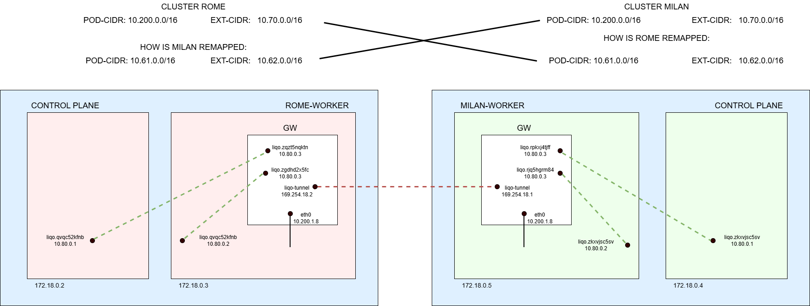

# Route Configuration

The **Route Configuration** is a Custom Resource Definition (CRD) that specifies a set of **policy-based routing** rules for directing traffic within the Liqo network.

**RouteConfigurations** are managed by a dedicated controller running on both gateway and fabric pods. This controller continuously reconciles the configurations and enforces the routing rules.

The routes presented in the following sections were collected from the setup in the picture, specifically from the **Rome cluster**.



## Before Peering

### \<local-cluster-id\>-\<node-name\>-extcidr (Gateway)

This RouteConfiguration contains routes that handle traffic targeting **local Service CIDR endpoints** from Liqo tunnels.

In the following example, we show `rome-worker-extcidr`.

All traffic arriving on the `liqo-tunnel` interface and destined to the two IPs `10.60.0.1` and `10.60.167.119` is forwarded to the corresponding Geneve interface that connects the gateway to the `rome-worker` node.

- `10.60.0.1` is the ClusterIP of `kubernetes.default`, allowing access to the API server.
- `10.60.167.119` is the ClusterIP of the `liqo-proxy` service.

```yaml
apiVersion: networking.liqo.io/v1beta1
kind: RouteConfiguration
metadata:
  labels:
    liqo.io/managed: "true"
    networking.liqo.io/route-category: gateway
    networking.liqo.io/route-subcategory: fabric-node
    networking.liqo.io/route-unique: rome-worker
  name: rome-worker-extcidr
  namespace: liqo
spec:
  table:
    name: rome-worker-extcidr
    rules:
      - iif: liqo-tunnel
        routes:
          - dev: liqo.zgdhd2x5fc
            dst: 10.60.0.1/32
            gw: 10.80.0.2
          - dev: liqo.zgdhd2x5fc
            dst: 10.60.167.119/32
            gw: 10.80.0.2
```

The same pattern applies to `rome-control-plane-extcidr`. Traffic is directed to the Geneve interface that connects the gateway to the control plane node

```yaml
spec:
  table:
    name: rome-control-plane-extcidr
    rules:
      - iif: liqo-tunnel
        routes:
          - dev: liqo.zqzt5nqktn
            dst: 10.60.0.1/32
            gw: 10.80.0.1
          - dev: liqo.zqzt5nqktn
            dst: 10.60.167.119/32
            gw: 10.80.0.1
```

### \<local-cluster-id\>-\<node-name\>-service-nodeport-routing (Gateway)

These rules use marks with policy routing to route the returning traffic towards the correct node. Refer to the **service-nodeport-routing** firewall configuration for more details.
Each `fwmark` identifies returning traffic for a specific node. The `targetRef` field specifies the internal node to which the traffic should be routed.

`rome-control-plane-service-nodeport-routing`:

```yaml
apiVersion: networking.liqo.io/v1beta1
kind: RouteConfiguration
metadata:
  labels:
    liqo.io/managed: "true"
    networking.liqo.io/route-category: gateway
    networking.liqo.io/route-subcategory: fabric
  name: rome-control-plane-service-nodeport-routing
  namespace: liqo
spec:
  table:
    name: rome-control-plane-service-nodeport-routing
    rules:
      - dst: 10.70.0.0/32
        fwmark: 1
        routes:
          - dev: liqo.zqzt5nqktn
            dst: 10.70.0.0/32
            gw: 10.80.0.1
        targetRef:
          kind: InternalNode
          name: rome-control-plane
```

`rome-worker-service-nodeport-routing `:

```yaml
spec:
  table:
    name: rome-worker-service-nodeport-routing
    rules:
      - dst: 10.70.0.0/32
        fwmark: 2
        routes:
          - dev: liqo.zgdhd2x5fc
            dst: 10.70.0.0/32
            gw: 10.80.0.2
        targetRef:
          kind: InternalNode
          name: rome-worker
```

### \<local-cluster-id\>-\<node-name\>-gw-node (Gateway)

Contains the rule that allows traffic from the gateway to nodes using Geneve tunnels. Note that Liqo uses the internal CIDR to assign an IP to every Geneve interface. If you need to debug the traffic between Geneve interfaces, you can ping each interface.

Also contains a route for each pod in the cluster. These routes allow traffic coming from other clusters to be forwarded to the correct node. This is necessary because Kubernetes does not provide a standard way to determine the pod CIDR range used for each node.

The `rome-worker-gw-node` RouteConfiguration shows how to reach the Geneve interface on the worker node and how to route traffic to all pods scheduled on that node:

```yaml
apiVersion: networking.liqo.io/v1beta1
kind: RouteConfiguration
metadata:
  labels:
    liqo.io/managed: "true"
    networking.liqo.io/route-category: gateway
    networking.liqo.io/route-subcategory: fabric
  name: rome-worker-gw-node
  namespace: liqo
spec:
  table:
    name: rome-worker
    rules:
      - dst: 10.80.0.2/32
        routes:
          - dev: liqo.zgdhd2x5fc
            dst: 10.80.0.2/32
            scope: link
      - iif: liqo-tunnel
        routes:
          - dst: 10.200.1.3/32
            gw: 10.80.0.2
            targetRef:
              kind: Pod
              name: liqo-crd-replicator-6b9444849f-lk4f2
              namespace: liqo
              uid: 9e0c841c-4947-4b40-9311-2454364861e4
          - dst: 10.200.1.6/32
            gw: 10.80.0.2
            targetRef:
              kind: Pod
              name: liqo-webhook-6d7c5d969d-k5pwb
              namespace: liqo
              uid: f5771c91-de43-4918-9b72-b0eafbd0de23
          - dst: 10.200.1.4/32
            gw: 10.80.0.2
            targetRef:
              kind: Pod
              name: liqo-controller-manager-657df86c78-5prm9
              namespace: liqo
              uid: 4bbcbc1f-052c-4d35-8566-1eb68834b8e8
          - dst: 10.200.1.2/32
            gw: 10.80.0.2
            targetRef:
              kind: Pod
              name: liqo-proxy-656b79b769-p7q7c
              namespace: liqo
              uid: 8860517f-2d4c-46a3-8dd3-a1ffc32d2bb1
          - dst: 10.200.1.5/32
            gw: 10.80.0.2
            targetRef:
              kind: Pod
              name: liqo-ipam-58c769c95c-w5cmg
              namespace: liqo
              uid: 7ae1b33b-7351-40c7-be98-1315c22b047c
          - dst: 10.200.1.7/32
            gw: 10.80.0.2
            targetRef:
              kind: Pod
              name: liqo-metric-agent-f48fdb9cd-bmg56
              namespace: liqo
              uid: 36016ede-27ca-4989-b39a-9b3feff485c1
          - dst: 10.200.1.11/32
            gw: 10.80.0.2
            targetRef:
              kind: Pod
              name: nginx-test-6b689f7cdc-7sjpv
              namespace: rome-test
              uid: 3cd4a834-2776-416e-990c-3dd7db280c47
```

Similarly, `rome-control-plane-gw-node` shows how to reach the Geneve interface on the control plane node and how to route traffic to all pods scheduled there:

```yaml
spec:
  table:
    name: rome-control-plane
    rules:
      - dst: 10.80.0.1/32
        routes:
          - dev: liqo.zqzt5nqktn
            dst: 10.80.0.1/32
            scope: link
      - iif: liqo-tunnel
        routes:
          - dst: 10.200.0.2/32
            gw: 10.80.0.1
            targetRef:
              kind: Pod
              name: coredns-7db6d8ff4d-kg2sm
              namespace: kube-system
              uid: 8a39a45e-c1a6-49e1-bb5f-ff02c871706e
          - dst: 10.200.0.4/32
            gw: 10.80.0.1
            targetRef:
              kind: Pod
              name: coredns-7db6d8ff4d-rgngs
              namespace: kube-system
              uid: 556ababb-2d19-4ede-80e3-cece144a8050
          - dst: 10.200.0.3/32
            gw: 10.80.0.1
            targetRef:
              kind: Pod
              name: local-path-provisioner-988d74bc-sgl8j
              namespace: local-path-storage
              uid: fd26c49d-8072-42a3-8b0a-81aa05d2ea4b
```

## After Peering

### \<remote-cluster-id\>-gw-ext (Gateway)

This route configuration contains all the routes that forward traffic from a gateway to another. It includes rules for remote pod CIDRs and external CIDRs.

Note that the routes with a destination of 10.70.0.0/16 are related to the external CIDR. It may seem strange since it is not using a remapped CIDR, but this is because the DNAT rules (which translate from remapped CIDR to original CIDR) act in **prerouting**.

In particular, the routes in `milan-gw-ext` show how traffic arriving on either of the two Geneve interfaces should be directed to the peered cluster (**Milan**):

```yaml
apiVersion: networking.liqo.io/v1beta1
kind: RouteConfiguration
metadata:
  labels:
    liqo.io/managed: "true"
    networking.liqo.io/route-category: gateway
    networking.liqo.io/route-unique: milan
  name: milan-gw-ext
  namespace: liqo-tenant-milan
spec:
  table:
    name: milan
    rules:
      - dst: 10.200.0.0/16
        iif: liqo.zqzt5nqktn
        routes:
          - dst: 10.200.0.0/16
            gw: 169.254.18.1
      - dst: 10.70.0.0/16
        iif: liqo.zqzt5nqktn
        routes:
          - dst: 10.70.0.0/16
            gw: 169.254.18.1
      - dst: 10.200.0.0/16
        iif: liqo.zgdhd2x5fc
        routes:
          - dst: 10.200.0.0/16
            gw: 169.254.18.1
      - dst: 10.70.0.0/16
        iif: liqo.zgdhd2x5fc
        routes:
          - dst: 10.70.0.0/16
            gw: 169.254.18.1
```

### \<remote-cluster-id\>-node-gw (Node)

This RouteConfiguration defines the routes applied on the node to reach the "remote" side of the Geneve tunnel, which is located on the gateway. It also includes routes for forwarding traffic to the gateway, destined for the remote cluster's **Pod CIDR** and **External CIDR**, via the Geneve interface.

In `milan-node-gw`:

- The first route specifies how to reach the Geneve interface on the gateway.
- The second route shows how to forward traffic to the gateway that is destined for the **remapped Pod CIDR** of the Milan cluster.
- The third route indicates how to forward traffic destined for the **remapped External CIDR**.

```yaml
apiVersion: networking.liqo.io/v1beta1
kind: RouteConfiguration
metadata:
  labels:
    liqo.io/managed: "true"
    networking.liqo.io/route-category: fabric
  name: milan-node-gw
  namespace: liqo-tenant-milan
spec:
  table:
    name: milan-node-gw
    rules:
      - dst: 10.80.0.3/32
        routes:
          - dev: liqo.qvqc52kfnb
            dst: 10.80.0.3/32
            scope: link
      - dst: 10.61.0.0/16
        routes:
          - dst: 10.61.0.0/16
            gw: 10.80.0.3
      - dst: 10.62.0.0/16
        routes:
          - dst: 10.62.0.0/16
            gw: 10.80.0.3
```
