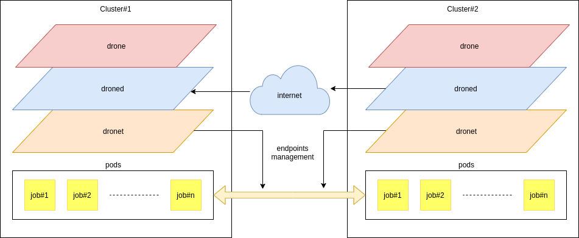
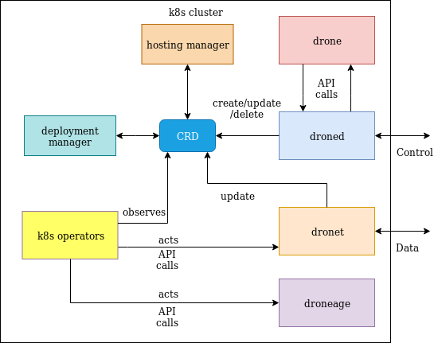
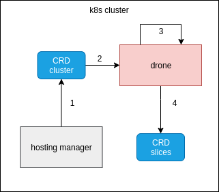
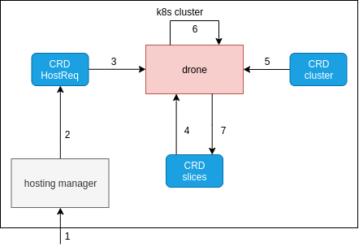
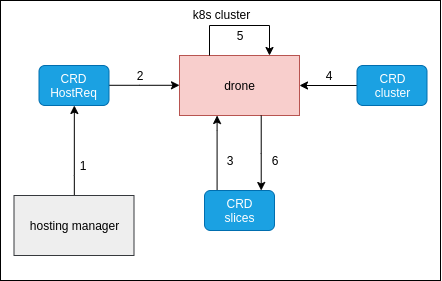
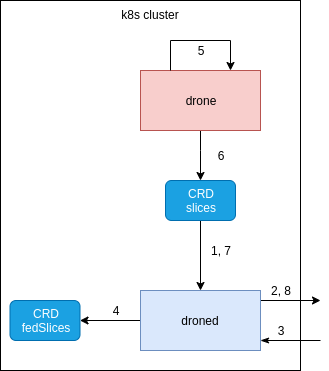
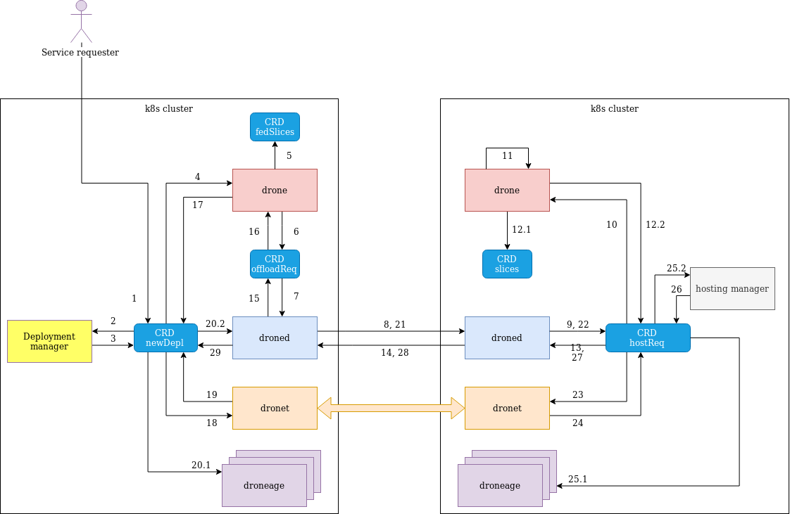

# DRONE v2.0 README
Distributed Resources Offload at Network Edge

## Design

### Inter-cluster structure

The system is composed by 3 different modules:
* [drone](drone.md): jobs scheduling and resource slicing.
* [droned](droned.md): inter-cluster communication. 
* [dronet](dronet.md): network management.

### Intra-cluster structure

## Workflows

### Resource slicing

The resource slicing procedure is devoted to slice the amount of computational resources to assign to the federation jobs. The slicing procedure details can be found [here](/docs/design/droned.md).
The resource slicing mechanism can occur in the following scenario:

#### Boot time

Boot time procedure occurs when the cluster is being launched. 

1. At boot-time the hosting manager creates the CRD cluster, containing all the resource for the cluster.
2. Drone detects that a new cluster CRD has been created.
3. Drone computes the resource slices.
4. Drone creates the slices CRD previously computed.

#### Hosting request

Hosting request procedure occurs when a cluster receives a request to host a job on behalf of another cluster.

1. The hosting droned receives an OffloadRequest from an offloading droned.
2. The hosting droned creates an HostRequest.
3. The creation of a new HostRequest is detected by the drone.
4. Drone fetches the current slices.
5. Drone fetches the cluster resources.
6. Based on the fetched slices and the available resources the drone decides whether to host the job and computes the new slices.
7. Drone updates the slices CRD with the above ones.
   
#### Resource release

Resource release procedure occurs when some resources become available again (after being used for a certain amount of time).

1. When the hosted job terminates or the garbage collector releases some locked resources, the hostReq CRD is deleted by the hosting manager.
2. The hostReq CRD deletion is detected by the drone.
3. Drone fetches the current slices.
4. Drone fetches the cluster resources.
5. Drone computes the new slices (by taking into account the amount of just released resources).
6. Drone updates the slices CRD with the above ones.

### Slices advertisement

Slices advertisement procedure occurs whenever the cluster must send to the federation clusters its own slices for making aware all the federation cluster that it is actively participating to the federation and it is available to offload some jobs with some resource contraints.

1. Droned periodically fetches the slices CRD.
2. Droned sends the slices over the federation as an advertisement message.
3. The advertisement messages are broadcasted to all the droned instances of the federation.
4. Whenever droned receives an advertisement message, it creates (or updates) a CRD fedSlices (that contains all the federation slices).
5. A request to offload a job can be asynchronously handled by the drone module. As a result of that operation, it computes again all the slices of own cluster.
6. Whenever the slices are computed again, drone updates the CRD accordingly.
7. Droned detects that the CRD slices has been modified.
8. Droned broadcasts the new advertisement message (in addition to the periodic one).

### Drone offloading

Drone offloading procedure occurs when the cluster wants to offload a set of job to the federation.

1. The service requester applies a CR defined by the CRD NewDeployment.
2. The creation of the CRD NewDeployment is detected by the deployment manager that applies the cluster policies to that deployment.
3. The deployment manager set the NewDeployment status to NEW.
4. When the status is being changed to new, drone operator is triggered.
5. Drone fetches the available federation slices and computes the winner cluster set for the NewDeployment.
6. Drone creates a CRD OffloadRequest for each job to deploy.
7. The creation of the CRD OffloadRequest is detected by the droned operator.
8. Offloading droned sends the request to each hosting droned.
9. When the hosting droned receive the OffloadRequest from the internet, it creates a CRD HostRequest.
10. The creation of the HostRequest in the hosting node is detected by drone.
11. Drone computes whether the cluster can host the requested job
12. If the job can be hosted, drone handles two different CRDs:
    1.  it updates the CRD slices (which describe the amount of resource availble for hosting federation jobs): since that moment that resource slice is reserved to the offloading cluster;
    2.  it updates the state of the HostRequest by setting it to ACCEPTED.
13. When the state of the HostRequest is being set to ACCEPTED, droned is triggered.
14. Hosting droned sends back to the offloading cluster an ACK (or eventually a NACK).
15. When the offloading droned receives the ACK, it updates the OffloadRequest CR by setting its state to ASSIGNED.
16. The state change to ASSIGNED is detected by drone.
17. Drone sets the state of the selected job in the NewDeployment CRD to ASSIGNED. If it is the last job to set, it sets also the NewDeployment status to SCHEDULED.
18. The status change of the NewDeployment to SCHEDULED is detected by dronet.
19. Dronet handles the networking operations and sets the state of the NewDeployment to CONNECTED.
20. The status change to CONNECTED of the NewDeployment is detected by:
    1.  droneage, that injects the requested routes into the cluster routing tables;
    2.  droned.
21. The offloading droned sends a message to the hosting droned for telling it that it is the assigned cluster for the job.
22. The hosting droned receives the message and updates the HostRequest by setting its status to SCHEDULED.
23. The status change to SCHEDULED of the HostRequest is detected by dronet
24. Dronet handles the networking operations and sets the state of the HostRequest to CONNECTED.  
25. The status change to CONNECTED of the HostRequest is detected by droneage and the launcher:
    1.  droneage injects the necessary routes for reaching the offloading cluster into the cluster routing tables;
    2.  the launcher launches the hosted job.
26. The launcher sets the HostRequest status to LAUNCHED
27. The status change to LAUNCHED of the HostRequest is detected by the droned module
28. The hosting droned module tells to the offloading cluster that the job has been launched.
29. Droned updates the status of the corresponding job to launched.
