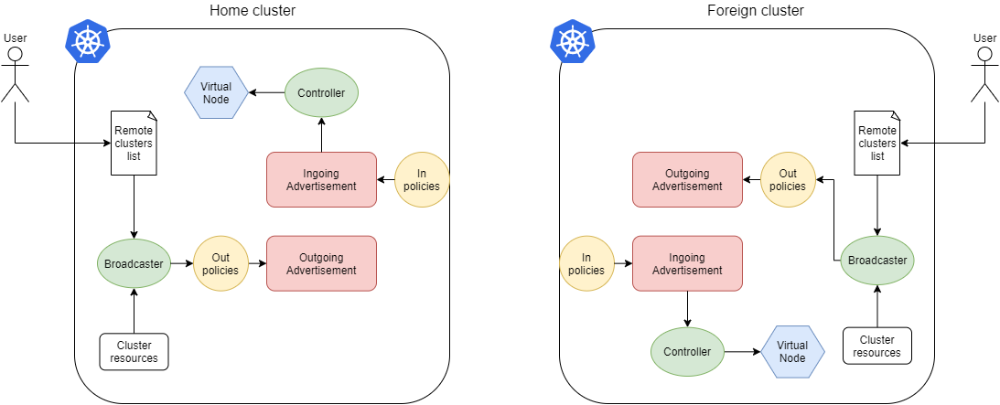

# droned design

## Advertisement management

### Outgoing chain
1. The user provides the information to communicate with the foreign cluster
2. The broadcaster reads this information to create a client to the foreign cluster
3. The broadcaster reads the cluster resources and, after applying some policies, creates an Advertisement CR
4. The Advertisement is pushed to the foreign cluster

### Ingoing chain
1. An Advertisement is received from the foreign cluster
2. The Advertisement is checked by a policy block
3. If the Advertisement is accepted it is sent to the controller
4. The controller creates a virtual node with the information taken by the Advertisement

### CRD generation
To modify the Advertisement you need to
1. open the file _api/v1beta1/advertisement_types.go_. Here you have all the `struct` types related to the Advertisement CRD
2. add/modify/delete the fields of `AdvertisementSpec` and/or `AdvertisementStatus`
3. run `make -f scripts/advertisement-operator/Makefile`; this will regenerate the code for the new version of Advertisement

### Run instructions
1. copy the kubeconfig of the foreign cluster in _data/foreignKubeconfig_ and _data/foreignKubeconfig_cm.yaml_
2. run `make install -f scripts/advertisement-operator/Makefile` on both your home cluster and foreign one. This will install the CRD Advertisement
3. an Advertisement CR will be created on foreign cluster (you can check with `kubectl get adv`)
4. if you want to create an Advertisement on home cluster you can use the sample by running `kubectl apply -f config/advertisement-operator/samples/protocol_v1beta1_advertisement.yaml`
