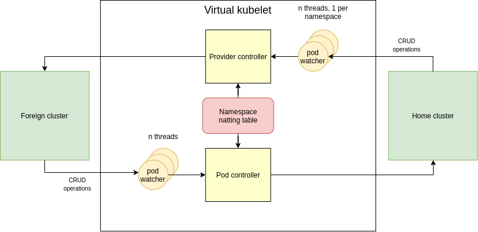
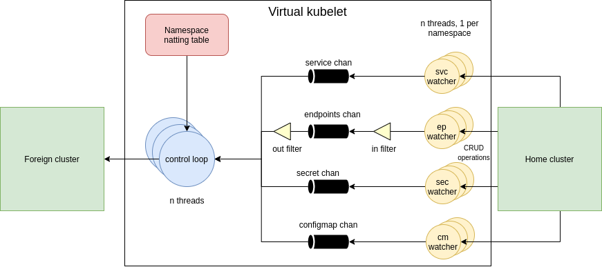

# Resource Sharing

## Overview

The resource sharing in Liqo is implemented by exploiting our implementation of the
[Virtual Kubelet (VK)](https://github.com/virtual-kubelet/virtual-kubelet) project, a component that, through a custom
kubelet implementation, is in charge of masquerading a remote cluster by means of a local (virtual) node. This local
node pretends to have available resources and to effectively handle the pods scheduled on it, but actually it acts as a 
proxy toward a remote Kubernetes cluster.

## Features

In order to transparently and seamlessly ensure the high-level behavior described above, our VK implementation needs to
provide the following set of features:

#### Virtual node creation and real-time reconciliation

At the startup, the VK creates (if not existing) a new Node without any available resources. A routine inside the VK is
in charge of filling up those fields with the ones embedded in the related advertisement resource. Whenever the
advertisement resource changes, the VK reconciles the node status according to the advertisement one. Once the new
node has been created and reconciled with the advertisement message, from the scheduler point of view, it is a real node
on which pods can be scheduled.

#### Pod lifecycle handling

Our aim in creating a virtual node that pretends to be a real node with real resources, is to have pods scheduled on it.
Once a pod is scheduled on the virtual node, the VK takes the received pod and is in charge of reflecting it remotely,
through a `POST` operation to the remote API server pods resource. The pod will then be handled by the remote scheduler
that will perform a new local scheduling operation of the received pod on one of its physical nodes. After the creation,
the VK is in charge of keeping the remote pod state aligned with the local one.

#### Multi-namespaced environment

The VK is able to work in a multi-namespaced environment: whether a new pod belonging to a specific namespace is
scheduled to the Virtual Node, the VK looks-up for the related translation entry in a resource of type
`NamespaceNattingTable` associated to the current VK instance. The `NamespaceNattingTable` CRD keeps a translation table
between local and remote namespaces.
If the lookup operation doesn't return a valid translation for the local namespace, it creates a new translation entry
by using the following syntax: `<local-namespace>-<home-cluster-id>`, then creates the remote namespace and starts
reflecting all the local resources (see below). Once a translation entry for the current namespace is set up, and the
reflection mechanism is configured, the received pods are sent to the foreign cluster, and their lifecycle is handled 
according to the above pattern.

#### Local Resource reflection

The resource reflection is a set of routines that remotely reflect the local resources needed by the offloaded pods,
among which:
* services;
* endpoints;
* secrets;
* configmaps.

#### Fault tolerance

Thanks to the `NamespaceNattingTable` resource, the pods statuses reconciliation and the resource reflection are tolerant
to the VK fault: if the VK pod faults (or is deleted), at the startup of the new VK pod (handled by the replica
controller), the remote cluster status is kept aligned with the local one seamlessly, thanks to the VK ability to hook
the previous state and restore its internal representation of both the remote and local resource statuses.

### Limitations

The main limitation of the VK is the reflection of the endpoints, a resource very hard to cope with, due to its
non-modular nature.
Since both home and foreign clusters aim at applying a lot of modifications to the `Endpoints`, there is a huge amount
of PUT requests that are very often throttled by the API server, leading to an instability of the `Endpoints` resources,
and a very high convergence time. The counter-measure to this behavior has been the enforcement of a timing in the
endpoints reflection and the a-priori deletion of the out-of-date local events. An easier and more natural `Endpoints`
management could be achieved by means of the
[`EndpointSlices`](https://kubernetes.io/docs/concepts/services-networking/endpoint-slices/), a feature still in beta.

## Architecture and workflow

#### Pod lifecycle handling

The pod lifecycle is the mechanism of keeping the home pods scheduled on the virtual node aligned with the remote ones.
It is a based on a double reflected mechanism:
* the Pod controller is in charge of keeping the local pods statuses aligned with the foreign ones;
* the provider controller keeps the foreign pods statuses aligned with the local ones;
* the `NamespaceNattingTable` is needed to translate the local namespace to the foreign one.

#### Resource reflection

The resource reflection makes use of a control loop managed by a set of threads, each one selecting an incoming event
(that can be of any type, regarding all kinds of objects) at once. In order to accomplish this behavior, every time a
new namespace has to be reflected, a set of routines that watches the main objects to reflect (svc, ep, sec, cm) is
spawned, with the goal of getting all the watched events and pushing them to a common channel (for each type), pulled
by the control loop routines. This pattern ensures a fixed amount of interactions with the API server, at scale with the
number of reflected namespaces. As said before, there is a filtering mechanism in the `Endpoints` reflection, in order
to avoid the throttling triggered by the foreign API server.

