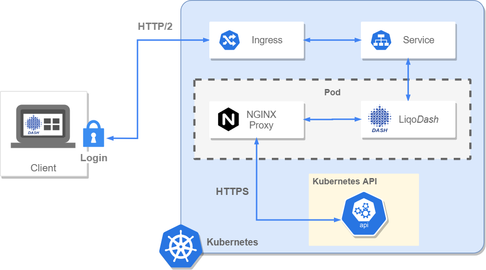

## Overview
LiqoDash is a general purpose, dynamic dashboard that lets you create your own views, and fully customize your resources.
LiqoDash is also a web-based UI for [Liqo](https://github.com/LiqoTech/liqo). It allows you to visualize and manage
all the Liqo components, as well as manage the status of the Liqo system itself.

## Components
- Kubernetes cluster: the platform where your resources reside and your apps, as well as the dashboard, are deployed.
- LiqoDash: the dashboard application, connects to Kubernetes to show and manage its resources.
- NGINX proxy: a minimal proxy needed to forward client-side API calls to the Kubernetes API server. 

## Architecture and workflow
In this section we will explain:
- How authentication and authorization to a Kubernetes cluster is managed
- How LiqoDash connects and makes calls to a Kubernetes API server



### Authorization and authentication
Whether you are using OpenID Connect ([OIDC](https://openid.net/connect/)) or a bearer token, the dashboard relies on
Kernetes role-based acces control ([RBAC](https://kubernetes.io/docs/reference/access-authn-authz/rbac/)) for 
authorization and authentication.

A service account with admin privileges is created during Liqo installation, but it is not mandatory to use its secret
token to access the dashboard. You could create your own user, with its set of rules and privileges, and use it instead
of the provided one. As a matter of fact, all the dashboard do is use the token (provided by the user via classic 
login or by the OIDC provider) to make calls to the Kubernetes API. If you do not have permission to access a resource,
Kubernetes will respond with a _Failure_ and the dashboard will report it graphically to the user. Of course, using an
admin user grants that all resources can be retrieved.

After the first login, the token is stored in a **Cookie**. That prevents successive interactions with the dashboard to
ask again for the token. The Cookie will be deleted when the browser is closed. Anyways, if you
are accessing LiqoDash with admin privileges, we recommend to always log out to avoid security risks.

### Connection and API calls
Now that we know how the _authorization_ and _authentication_ works, let's take a look at how the _connection_ is 
established between the client (the dashboard) and the server (the Kuberntes cluster), and the workflow of an API call.

- Client side: through a browser compatible Kubernetes Javascript library (described later) the dashboard makes a call to the Kubernetes API
(e.g. we want to list all CRDs present in the cluster). This is not a direct call, meaning that we don't ask directly the
Kubernetes API server (because of a series of reasons described in the next passages) but it contains nonetheless all
we need to make an API call: the bearer token (that we need to access Kubernetes resources), the path to the endpoint
we want to access and, of course, the body and the option headers we need if we are creating or updating resources.
Because we are transfering sensible data (first of all the token), the connection needs to be secure and its only natural
to use HTTPS, and in particular HTTP/2 (because of a series of mechanisms that relies on the features of HTTP/2).

- Ingress (_optional_): we suggest you to use an [Ingress](https://kubernetes.io/docs/concepts/services-networking/ingress/)
to expose the dashboard through the internet. Unless you have a reason to not use it (e.g. you do not have an Ingress Controller),
this is the best solution to link the dashboard to your Kubernetes cluster. Please keep in mind that this is optional
and LiqoDash will work the same way whether you have an Ingress or not.

- LiqoDash service: the _request_ is then forwarded to the LiqoDash service. If you are not using an Ingress you will
access the dashboard directly through the service, exposing it via NodePort or port-forward (please check the official
documentation on [accessing Liqodash](https://doc.liqo.io/user/dashboard/#accessing-liqodash)). The service is the point
of contact between the user and the pod (the resource that actually contains the dashboard application).

- NGINX Proxy: as we said earlier, we can not make a direct API call, but instead we have to use a minimal proxy 
that will be the one that will do the _real_ API call.
In detail, without a backend, and sending requests to the Kubernetes API directly from the dashboard, there could be some
errors performing these requests. Basically it is _CORS_ errors, where either the browser would not accept a cross-origin
request or the API server would not accept the request, responding with an error, if it does not allow cross-origin
requests. The CORS mechanism is very important for the safety of both client and server, so we put a middleware
between the dashboard and the actual API server: a proxy. The proxy receives requests from the dashboard and forward them to
the API server; same logic for the server responses. Connections between proxy and dashboard/API server are secured
(_HTTPS_). With a proxy we have no more CORS related errors, keeping the security that this mechanism provides.

- Kubernetes API: at this point, the API call is managed by the Kubernetes API validation mechanism, that verifies that 
what we are making is a valid request, with a valid token and the user has the privileges to access the resources it is asking for. 
Whatever the response is (could be a _Success_ or a _Failure_) it will be forwarded the same way it arrived, and will
be showed in the dashboard accordingly.

## Frontend
Here we will explain how the client-side of the dashboard is built and its key fetaures.

### Frameworks
- User interface: [ReactJS](https://en.reactjs.org/)
- Module bundler: [Webpack](https://webpack.js.org/)
- Design components: [Ant Design](https://ant.design/)

### Kubernetes Javascript Library
The library used to connect to the Kubernetes API is [kubernetes-client-javascript](https://github.com/LiqoTech/kubernetes-client-javascript),
our patched version of the [official one](https://github.com/kubernetes-client/javascript).
As the Kubernetes developer team states, the client of official library is implemented only for server-side, using NodeJS.
This is because of various dependencies that can only be solved server-side, that would not allow the use of these API
to a pure JS client. The solution was to use a patched version is the same as before, but with a slightly different
build file. In fact in this project it is performed a binding of those server-side-only modules with
user-accessible ones. With this library we are able to make calls to the Kubernetes API inside the dashboard, without
the need of a backend.

### Watches
One of the key features of the dashboard is its **real-time responsiveness**, meaning that If a resource or component
gets updated (or added/deleted) outside the dashboard, the dashboard will be automatically updated without the
need to refresh the page. This is obtained thanks to the `watches`, a Kubernetes mechanism that allow the dashboard
to get change notifications and synchronize the state of resources. In detail, whenever we are interested in viewing
the real-time state of a _resource_ (e.g. we are on a view that shows a specific CRD and its related custom resources)
and getting notified about its change, a `watch` is opened and will remain active until we leave the view.
In simple terms, a `watch` is a _HTTP/2_ connection established with the cluster's API server.

### Custom Views
A `Custom View` is a Custom Resource that contains a set of CRDs that the dashboard will display in a separate page,
with a customizable layout. Being a feature that comes with LiqoDash, the dashboard introduces a certain level of abstraction
in creating a Custom View (in fact, you don't know you are creating a Custom Resource of type `View`, but that
is what happens under the hood!). At the start of the application, LiqoDash will get all of the Custom Resources of type 
`View` and make them available for the user to explore. Of course the creation/deletion or the update of a Custom View
is easier using the dashboard, but, because the two are indepentent from one another, you can always perform these
operation directly in the Kubernetes CLI. For example, to list all the `View` in the `liqo` namespace, you can do:
```
kubectl get views -n liqo
```
Every update will be reflected instantly in the dashboard.

If you want to know more about Custom View and how to create them, please refer to the [official documentation]().

### Favourite management
You can mark every CRD you want as favourite, both from the [CRD list view]() or the [single CRD view]().
What happens behind the scenes is that marking a CRD as favourite will create an `favourite: "true"` annotation in the
CRD's metadata. When a CRD is removed from the favourites, the annotation will be deleted.
At the start of the application, LiqoDash will check if a CRD has an annotation with a `favourite` parameter and, in case
this is true, will put it in the sidebar, easily accessible by the user.
Of course you can annotate a CRD as favourite directly from the Kubernetes CLI. For example:
```
kubectl annotate crd my-crd.example.com favourite='true'
```
The marking will be instantly caught up and displayed in the dashboard.
