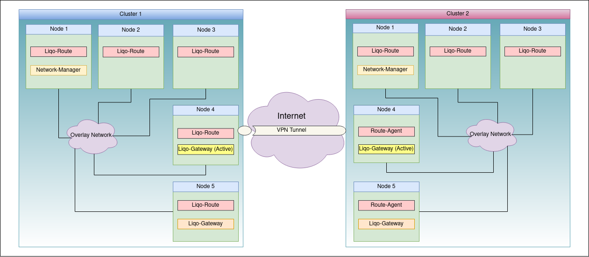

## Overview

The networking module is in charge of connecting networks of different Kubernetes clusters. It aims at extending the Pod-to-Pod communications to multiple clusters, by flattening the networks between the connected clusters. The interconnection between clusters is done in a dynamic and secure way on top the existing network configuration of the clusters. Liqo's network isolates its configuration as much as possible using overlay networks, custom network namespaces, custom routing tables, and policy routing rules in order to avoid changing the existing network configuration. At the same time, when connecting to remote clusters no input is required to the user in order to configure the interconnection with remote clusters other than the ones required at [install time](../../../installation/pre-install#peering-requirements).

Liqo network consists of several components that enable workloads connection across multiple clusters:

* [Liqo-Network-Manager](./components/network-manager): manages the exchange of network configuration with remote clusters;
* [Liqo-Gateway](./components/gateway): manages life-cycle of secure tunnels to remote clusters;
* [Liqo-Route](./components/route): configures routes for cross-cluster traffic from the nodes to the active Liqo-Gateway.

The diagram below illustrates the basic architecture of Liqo networking:

## Support Matrix

Liqo's networking is designed to be cloud provider and network plugins (CNI) agnostic. At the time being Liqo has been tested with the following CNIs and cloud providers:

* [Weave](https://github.com/weaveworks/weave)
* [Flannel](https://github.com/coreos/flannel)
* [Canal](https://docs.projectcalico.org/getting-started/kubernetes/flannel/flannel)
* [Calico](https://www.projectcalico.org/)
* [Azure AKS - Kubenet](https://docs.microsoft.com/en-us/azure/aks/configure-kubenet)
* [Azure AKS - Azure CNI](https://docs.microsoft.com/en-us/azure/aks/configure-azure-cni)
* [AWS EKS - amazon-vpc-cni-k8s](https://github.com/aws/amazon-vpc-cni-k8s)
* [Google GKE - VPC-Native](https://cloud.google.com/kubernetes-engine/docs/how-to/alias-ips)

