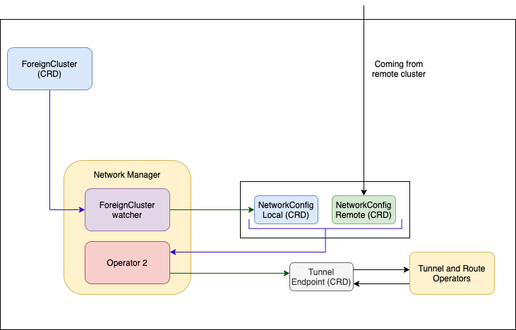

The Liqo Network Manager component manages the creation of the [`networkconfigs.net.liqo.io`](https://github.com/liqotech/liqo/blob/master/apis/net/v1alpha1/networkconfig_types.go) custom resources for the remote clusters. It also processes the [`networkconfigs.net.liqo.io`](https://github.com/liqotech/liqo/blob/master/apis/net/v1alpha1/networkconfig_types.go) received from the remote clusters remapping the remote networks if they overlap with any of the address spaces used in the local cluster. And when the [`networkconfigs.net.liqo.io`](https://github.com/liqotech/liqo/blob/master/apis/net/v1alpha1/networkconfig_types.go) exchanged by the two clusters are ready the Liqo Network Manager creates a new resource of type [`tunnelendpoints.net.liqo.io`](https://github.com/liqotech/liqo/blob/master/apis/net/v1alpha1/tunnel_endpoint_types.go) which models the network interconnection between the two clusters. The [`tunnelendpoints.net.liqo.io`](https://github.com/liqotech/liqo/blob/master/apis/net/v1alpha1/tunnel_endpoint_types.go) is reconciled by the [Tunnel Operator](../gateway#tunnel-operator) and the [Route Operator](../route#route-operator).

The following diagram illustrates how Liqo Network Manager creates the [`tunnelendpoints.net.liqo.io`](https://github.com/liqotech/liqo/blob/master/apis/net/v1alpha1/tunnel_endpoint_types.go).

#### Network Parameter Exchange

The network parameters between two clusters are exchanged using the [`networkconfigs.net.liqo.io`](https://github.com/liqotech/liqo/blob/master/apis/net/v1alpha1/networkconfig_types.go) custom resources replicated between the clusters by the Liqo CRDReplicator component.

1. The network configuration of Cluster1 is saved in a local custom resource (`NCFG 1->2`) containing the ClusterID of the remote cluster to whom is  destined. Same step done in Cluster2;
2. `NCFG 1->2` is replicated to the remote cluster by the `CRDReplicator`, running in Cluster1 who knows how to interact with the API server of Cluster2. Same step done in Cluster2;
3. In Cluster2 the custom resource `NCFG (1->2)` is processed and its status updated with the NAT information if any. The same is done with `NCFG (2->1)` in Cluster1.
4. The CRDReplicator running in Cluster1 reflects this changes in the local resource `NCFG(1->2)`. Same step done in Cluster2; The TunnelEndpointCreator in Cluster1 combining the status of `NCFG(1->2)` and the spec of `NCFG (2->1)` it has all the necessary information to create the custom resource `TEP (1-2)` of type [`tunnelendpoints.net.liqo.io`](https://github.com/liqotech/liqo/blob/master/apis/net/v1alpha1/tunnel_endpoint_types.go).
