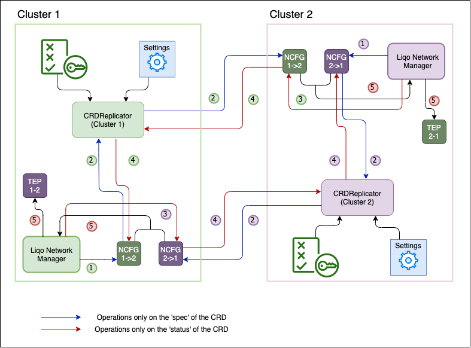

The **Liqo Network Manager** is one of the Liqo components in charge of enabling peered clusters to communicate one to another, handling the creation of the `networkconfigs.net.liqo.io` custom resources that will be sent to remote clusters.
Those special resources contain the network configuration of the home cluster: the PodCIDR, for example, is one of the fields of the Spec section of the resource.

{}
The PodCIDR is the IP addressing space used by the CNI to assign addresses to Pods (e.g., _10.0.0.0/16_).
{}

In addition, the Network Manager also processes the NetworkConfigs received from the remote clusters and remaps the remote networks if they overlap with any of the address spaces used in the local cluster (see [IPAM](#ipam) for more information).
When the NetworkConfig exchanged by the two clusters are ready, the Liqo Network Manager creates a new resource of type `tunnelendpoints.net.liqo.io` which models the network interconnection between the two clusters.

The following diagram illustrates how Liqo Network Manager creates the TunnelEndpoint.
The Network Manager creates a local NetworkConfig for each `foreignclusters.discovery.liqo.io` resource that, as the name suggests, represents a foreign cluster.
The diagram shows also that remote clusters create their own NetworkConfig on the home cluster: the reader can guess that the local NetworkConfig is replicated on the remote cluster in the same way.
Once the Network Manager has collected both the remote and the local NetworkConfig, an embedded operator is in charge of creating the TunnelEndpoint resource, that resumes the information contained in both resources. 
The TunnelEndpoint is then reconciled by the [Tunnel Operator](../gateway#tunnel-operator) and the [Route Operator](../route#route-operator).

A NetworkConfig is created populating only its Spec section with networks used in the cluster as well as parameters for the VPN tunnel configuration.
Instead, the Status section of a NetworkConfig is updated by the remote cluster the resource has been created for (each NetworkConfig specifies in the Spec section its recipient).
The Status section is used to signal to the cluster that have created the resource if its networks have been remapped by the remote cluster.

{}
Traffic between clusters passes through a VPN tunnel configured by exchanging NetworkConfigs.
{}

The following diagram shows how information about the PodCIDR are exchanged by clusters. However, depicted NetworkConfigs do not specify only this address space, but instead contain many other information that have been ignored for the sake of semplicity.
In the provided example, the PodCIDR of the remote cluster is already used (or creates conflicts) in the local cluster, therefore in step 2 the IPAM module maps it on another network. The local NetworkManager notify the remote cluster about the remapping by updating the Status of the resource in step 3. After the remote cluster have processed the local NetworkConfig (Step 4), the IPAM module stores how the remote cluster has remapped the local PodCIDR. Finally, the Network Manager creates the TunnelEndpoint resource combining information contained in both NetworkConfigs.

#### Network Parameters Exchange

The network parameters between two clusters are exchanged using the NetworkConfig custom resources replicated between the clusters by the Liqo CRDReplicator component.

1. The network configuration of Cluster1 is saved in a local custom resource `NCFG(1->2)`, which contains the ClusterID of the remote cluster that we want to peer with. Same step done in Cluster2.
2. The `CRDReplicator` running in Cluster1 (which knows how to interact with the API server of Cluster2) replicates `NCFG(1->2)` in the remote cluster. The same step is done in Cluster2.
3. Once replicated in Cluster2, the custom resource `NCFG(1->2)` (living in Cluster 2) is processed and its status updated with the NAT information (if any). The same is done with `NCFG(2->1)` in Cluster1.
4. The `CRDReplicator` running in Cluster1 reflects the updated `NCFG(1->2)` back in the local cluster. The same happens in Cluster2.
5. The Network Manager in Cluster1 creates the custom resource `TunnelEndpoint` `TEP(1-2)` by using the information present in `NCFG(1->2)` and `NCFG(2->1)`.

### IPAM
Embedded within the Liqo Network Manager, the IPAM (IP Address Management) is the Liqo module in charge of:
1. Manage networks currently in use in the home cluster.
2. Translate the IP address of an offloaded remote pod (assigned by a foreign cluster) in the corresponding IP address that is visible from the home cluster.
3. Translate Endpoints IP addresses during the [Reflection](../../../offloading/features/api-reflection#Overview).

#### Networks management
The cluster CNI provider assigns to each Pod a unique IP address, which is valid _within the cluster_ and that allows Pods to talk to each other, directly, even without the use of a Kubernetes _service_.
Given that, Liqo extends a (first) cluster with the resources shared by a (second) remote cluster, therefore it has to enable Pods in different (peered) clusters to talk to each other directly.
This mechanism must work even if IP addresses are valid only within the context of the cluster and therefore Pods belonging to _two_ clusters cannot talk directly.
In addition, Liqo enables inter-cluster Pod-to-Pod without making any assumption on the address spaces (i.e. PodCIDR and ExternalCIDR) configured in each cluster.
Therefore, Liqo must work even when the peered clusters have the same PodCIDR, hence the two Pods could have conflicting IP addresses.

{}
The ExternalCIDR is the IP addressing space used by Liqo for assigning addresses to external resources during Reflection (see more [Here](#reflection-of-external-endpoints)).
{}

Liqo, and in particular its IPAM module, checks if the PodCIDR of a remote cluster is already used in the local cluster.
- If it is available, the IPAM reserves that network for the remote cluster. This means IP addresses assigned in the remote cluster are now valid also in the home cluster.
- If a conflict is detected, the IPAM module remaps the (conflicting) PodCIDR of the remote clusters into a new address space, again reserved for that cluster.
The same procedure happens for the ExternalCIDR.

{}
The traffic toward remapped networks will require an additional NAT operation carried out by the [Tunnel Operator](../gateway#tunnel-operator) in the data plane.
{}

In conclusion, the IPAM maintains a list of all the networks currently in use in the home cluster and when a new peering takes place, adds the network reserved to the remote cluster to the list. The network remains in the list as long as the peering is active and it is removed when the peering is terminated. In this way the network freed after the termination of a peering becomes available for future use.

{}
You can specify reserved networks in `clusterconfigs.config.liqo.io` resource. IPAM will add these networks to the list of used networks and will no longer take it in consideration for remote clusters.
{}

#### IP addresses translation of offloaded Pods
Liqo enables the offloading of workloads on (remote) peered clusters, giving at the same time the illusion that all Pods are running on the local cluster.
The [Virtual Kubelet (VK)](../../../offloading#virtual-kubelet) is the component in charge of offloading workloads on the remote cluster, while keeping their status always synchronized between the two clusters.
This allows the administrator of the local cluster to inspect the status of all offloaded pods (hence, running remotely) such as they were running locally.
However, offloaded Pods are assigned an IP address by the CNI of the foreign cluster, as they actually are run there.
Even if these addresses are valid on the foreign cluster, they may have no meaning in the original cluster.

Assume that clusters A and B have both PodCIDR equal to 10.0.0.0/24 and that their administrators agree to share resources by establishing a Liqo peering.
Thus, IPAM module of B decides to map A's PodCIDR on an available network, say 192.168.0.0/24.
After the peering has been completed, B offloads Pod A1 on cluster A.
If the CNI of cluster A assigns IP address 10.0.0.34 to Pod A1, the VK(A) running in B detects the IP assignment and needs to update the Shadow Pod Status.

{}
The Shadow Pod is a local copy of the Pod resource that is created and kept up to date by Liqo when offloading a Pod.
{}

In this particular example, while pod A1 has IP 10.0.0.34, its shadow copy (in cluster B) will have IP 192.168.0.34.
Since the IPAM module keeps track of how remote networks have been remapped by the home cluster (see [Networks management](#networks-management)), it can take care of the translation of addresses.
For this reason, IPAM provides an API consumed by the VK when the latter has to update the Shadow Pod Status and therefore its IP address.

{}
The [Tunnel Operator](../gateway#tunnel-operator) will carry out the proper NATs operations in the data plane, translating IP src/dest addresses of the packets coming from/directed to the offloaded Pod.
{}

The IPAM module achieves this task by keeping track of how foreign clusters have remapped local networks and by providing offloaded Pod IP addresses to the Virtual Kubelet when it has to update the Status of Shadow Pods.

#### Reflection
The [Reflection](../../../offloading/features/api-reflection#Overview) is one of the most relevant Liqo features, which is carried out by the VK and deals with the replication of local Kubernetes resources on foreign clusters, in particular _Services_ and _Endpoints_.

In general, Endpoints that are going to be reflected can live either on:
1. The local cluster, this is the case of Pods running on the home cluster.
2. Elsewhere, such as a Pod not running on the home cluster or on the cluster the reflection is going to happen, but in a third one.

In both cases, the IPAM module plays a decisive role, as it is in charge of translating IP addresses of reflected Endpoints.

##### Reflection of local Endpoints
Similarly to what has been described in the [Translation of offloaded Pods](#ip-addresses-translation-of-offloaded-pods) Section, when crossing the 
{}
This documentation section is a work in progress
{}

##### Reflection of external Endpoints
{}
This documentation section is a work in progress
{}
Thus, the External CIDR network is used whenever the home cluster has to expose on a foreign cluster an external resource (such as a Pod living on a third cluster).

It is worth to point out that traffic toward External CIDR passes through the cluster that has reflected the external resource before reaching its final destination (_hub and spoke_ topology such as A <--> B <--> C, where B offloaded Pods in both A and C, and a Pod in A has to contact a Pod in C).
This means that the cluster that reflects a Pod using its External CIDR receives the data-plane traffic directed to that Pod, which has to be further redirected in the third cluster to reach the actual Pod.
This is achieved thanks to the `natmappings.net.liqo.io` resource, which is populated by the IPAM (in Cluster B) with the associations between the Pod IP addresses and the associated External CIDR addresses.
This resource is reconciled by the [Tunnel Operator](../gateway#tunnel-operator) that adds the proper NAT rules.
