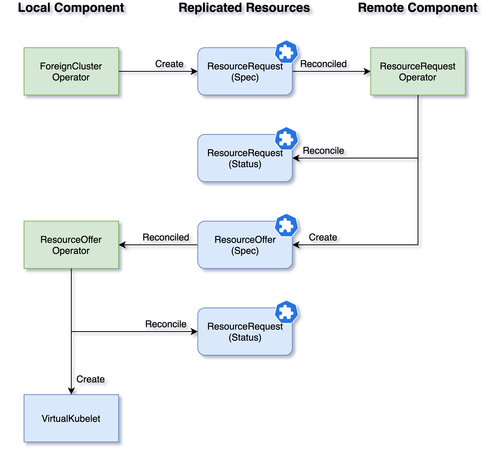

## Overview

### What is the Liqo Peering

The Liqo peering is the process that leads two different clusters to peer each other without requiring any manual configuration.
These two clusters will then be able to offload their workloads and their services over the peering.

The Liqo peering has some fundamental properties:

* __Simple__: no configuration has to be shared manually between the two clusters.
* __Directional__: the user can enable only one of the two clusters to offload its resources.
* __Peer to Peer__: only the two clusters participating in the peering are involved in this process: no external service is required.
* __Reversible__: after two clusters established the peering, it is always possible to revert this process and make them two completely different clusters again.

### Peering Steps

#### 1. Authentication

During the _Liqo Peering_, two separated and different clusters need to contact their [_Kubernetes API Server_](https://kubernetes.io/it/docs/concepts/overview/components/#kube-apiserver) each other and to authenticate to it.
The [_Authentication_](features/authentication) step provides a mechanism that allows the clusters sharing a common secret (an authentication token) to forge and issue the certificates required for the [_Kubernetes Authentication_](https://kubernetes.io/docs/reference/access-authn-authz/authentication/#x509-client-certs) each other.

#### 2. Peering Initialization

When a cluster wants to offload its workloads or its services to a remote one, it needs to initialize a _Liqo Peering_.
The local cluster needs to notify to the remote one this intention sending a message to its API Server.

#### 3. Peering Acceptance

The remote cluster has to validate the request and compute the amount of resource that it can allocate for the local cluster workloads. These resources are dynamic and can change over time when the cluster global load changes.

#### 4. Virtual Node Creation

The local cluster creates a new node (a [_Virtual Node_](../offloading/)) with the resource capacity provided by the remote one. This is like a standard Kubernetes Node, the [_Kubernetes Scheduler_](https://kubernetes.io/it/docs/concepts/overview/components/#kube-scheduler) can assign workload to it.

### How it works

During the peering process, the _Liqo Control Plane_ exchanges some shared CRs among different clusters.
It achieves this goal by exchanging messages with the replication of the CRDs.
The Operators involved in this mechanism reconcile the CRDs locally; the [_CRDReplicator_ component](features/crd-replicator/) will propagate these changes to the remote cluster.

The first step is the [creation of an identity](features/authentication/) to be able to communicate with the remote cluster. The local _ForeignCluster Operator_ is in charge of forging a key and a _Certificate Signing Request (CSR)_ and sending the request to the remote Authentication endpoint. That remote service checks if it can be accepted the request (the provided token is correct), issues a certificate, and assign to this identity some basic permission.

The local cluster can indicate the intention to [establish a peering](features/establish-interconnection/) to a remote one creating a _ResourceRequest CR_.
The remote _Liqo Controller Manager (LCM)_ reconciles this resource and (if accepted) forges a _ResourceOffer CR_.
At that point, the local _LCM_ reconciles this last resource and (again, if accepted) it is now able to build a new local _Virtual Kubelet_ that provides a new virtual-node where Kubernetes can schedule new jobs: if a pod is assigned to a _Virtual Node_, it will be actually sent to the respective remote cluster.

