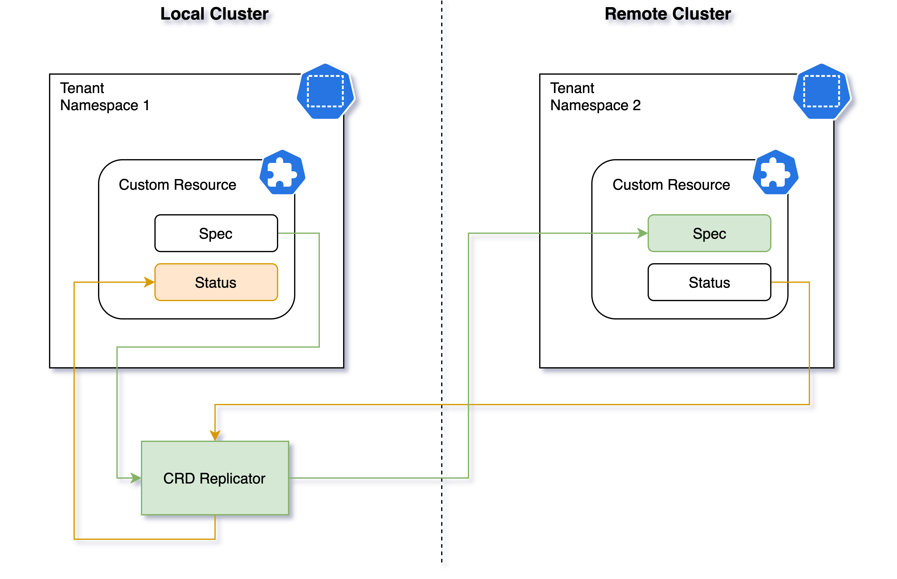

### Overview

The __CRD Replicator__ component is the only Liqo component (but the [VirtualKubelet](../../../offloading/)) that operates on both the clusters.
It is the engine of the Liqo peering performing the replication of the resources over different [_Tenant Namespaces_](../tenant-namespace) and to keeping them in sync.

It starts operating when it finds a valid [identity](../authentication) for a remote cluster and establishes a double control loop:

1. watch the local resources and enforce their __spec__ over the __spec__ of the replicated resources.
2. watch the replicated resources and enforce their __status__ over the __status__ of the local resources.

Thanks to this mechanism, Liqo uses CRDs to communicate with a remote cluster using the resources _spec_ to provide the local decision/status and the resources _status_ to get the answer from the control plane of the remote cluster.

